## Part 2 (GPIO Handling)

> This part updates the previous starter driver with GPIO support. Driver would be able to control any available GPIO and be configurable from user-space via character driver defined earlier.

> The blog is not written by a professional, so there may be inaccuracies. Please verify the important information.
{: .prompt-danger }

## Modularisation

This is a proper place to divide our driver into several modules, where each one will handle some specific task, while the main `driver.c` file will define the main initialisation part. It also helps with readability and makes it more clear what part of the code handles. So let's create a new `gpio.c` file, where we will define all GPIO related functions.

```bash
.
├── compile_commands.json
└── src
    ├── driver.c
    ├── fan.h
    ├── gpio.c
    └── Makefile
```
{: .nolineno }

Since we wish to call functions defined in `gpio.c` it would be great to declare them in the header file `fan.h`, which will be available for all our modules:

```c
/* Header file for Raspberry Pi driver. File: fan.h */

#ifndef __RPI4F__
#define __RPI4F__

#define DEVICE_NAME "rpifan"
#define CLASS_NAME "fan"

#endif
```

Before declaring any files it is good to move all driver's related definitions like `DEVICE_NAME` and `CLASS_NAME` to the header. do not forget to include the header for all of your modules:

```c
/* File: driver.c */
#include<linux/kernel.h>
#include<linux/module.h>
#include<linux/cdev.h>
#include<linux/fs.h>

#include"fan.h"

#define KBUF_SIZE 4

/**************** Driver data fields ****************/
...
```

Before manipulating with GPIOs we shall define which data type will be used to point out which GPIO pin shall be used for our fan and probably think about later PWM support.

> The `KBUF_SIZE` symbol might not be the best option to move to the header file as it only defines the size of buffer, that is being used when copying data from user and to user, inside the `rpfan_read` and `rpfan_write` functions. Symbols which are more local are better to not be moved into a public header file.  
{: .prompt-tip }
### The Configuration Data Type

To decide about the data type, let's take a glance on Raspberry Pi GPIO header:


_Raspberry Pi 40-pin Header_

Here are the two 5V pins, primarily used for the fan, along with the 3.3V pin and several GND pins. Sometimes these pins might be needed for other purposes, so we want the ability to set the remaining pins high in order to connect our fan.

Some of those pins are reserved for advanced use, like UART, SPI, I$^2$C etc., however the driver must allow to use any of available pins.

> This pinout is taken from [pinout.xyz](https://pinout.xyz/). It provides a precise description of each pin and their eventual function. This page also provides pinouts for different Raspberry Pi HATs, pHats and addons.
{: .prompt-info }

Most[^footnote] of Raspberry Pi platforms has this 40-pin header, so the driver would be compatible with all of them, since Linux would handle most of the differences. With all power pins ignored, that leaves us with 28 configurable GPIO pins, so 5 bits would be enough to define all of them. If we wish to store the configuration in one byte, then three free bits are left for the PWM states.

```mermaid
block-beta
	columns 4
	PWM["PWM\nSTATE"]
	GPIO["GPIO PIN"]:3
	PWM_BITS["3 BITS"]
	GPIO_BITS["5 BITS (LOW)"]:3
	
	block:PWM_DUTY_CYCLE:1
		columns 1
		PWM_S1["100%"]
		PWM_S2["88%"]
		PWM_S3["76%"]
		PWM_S4["64%"]
		PWM_S5["52%"]
		PWM_S6["40%"]
		PWM_S7["28%"]
		PWM_S8["16%"]
	end
	
	block:GPIO_VALUES:3
		columns 4
		GPIO_S0["PIN 0"]
		GPIO_S1["PIN 1"]
		GPIO_S2["PIN 2"]
		GPIO_S3["PIN 3"]
		GPIO_S4["PIN 4"]
		GPIO_S5["PIN 5"]
		GPIO_S6["PIN 6"]
		GPIO_S7["PIN 7"]
		GPIO_S8["PIN 8"]
		GPIO_S9["PIN 9"]
		GPIO_S10["PIN 10"]
		GPIO_S11["PIN 11"]
		GPIO_S12["PIN 12 PWM0"]
		GPIO_S13["PIN 13 PWM1"]
		GPIO_S14["PIN 14"]
		GPIO_S15["PIN 15"]
		GPIO_S16["PIN 16"]
		GPIO_S17["PIN 17"]
		GPIO_S18["PIN 18 PWM0"]
		GPIO_S19["PIN 19 PWM1"]
		GPIO_S20["PIN 20"]
		GPIO_S21["PIN 21"]
		GPIO_S22["PIN 22"]
		GPIO_S23["PIN 23"]
		GPIO_S24["PIN 24"]
		GPIO_S25["PIN 25"]
		GPIO_S26["PIN 26"]
		GPIO_S27["PIN 27"]
		
		GPIO_S28["RESERVED"]
		GPIO_S29["RESERVED"]
		GPIO_S30["RESERVED"]
		GPIO_S31["RESERVED"]
	end
	
	PWM --> PWM_BITS
	GPIO --> GPIO_BITS
	PWM_BITS --> PWM_DUTY_CYCLE
	GPIO_BITS --> GPIO_VALUES
	
	classDef gpioI2C fill:blue,stroke:#333,stroke-width:2px
	classDef gpioSPI fill:magenta,stroke:#333,stroke-width:2px
	classDef gpioUART fill:purple,stroke:#333,stroke-width:2px
	classDef gpioPWM fill:green,stroke:#333,stroke-width:2px
	classDef reserved fill:red,stroke:#333,stroke-width:4px
	
	style PWM_S8 fill:#004c00,stroke:#333,stroke-width:2px
	style PWM_S7 fill:#006600,stroke:#333,stroke-width:2px
	style PWM_S6 fill:#008000,stroke:#333,stroke-width:2px
	style PWM_S5 fill:#009900,stroke:#333,stroke-width:2px
	style PWM_S4 fill:#00b300,stroke:#333,stroke-width:2px
	style PWM_S3 fill:#00cc00,stroke:#333,stroke-width:2px
	style PWM_S2 fill:#00e600,stroke:#333,stroke-width:2px
	style PWM_S1 fill:#00ff00,stroke:#333,stroke-width:2px
	
	class GPIO_S28,GPIO_S29,GPIO_S30,GPIO_S31 reserved
	class GPIO_S0,GPIO_S1,GPIO_S2,GPIO_S3 gpioI2C
	class GPIO_S7,GPIO_S8,GPIO_S9,GPIO_S10,GPIO_S20,GPIO_S19,GPIO_S21 gpioSPI
	class GPIO_S14,GPIO_S15 gpioUART
```



Block diagram above shows the data structure of the global configuration variable that we are going to use. 5 bits could easily handle all 28 GPIO pins, while the rest would allow us to define 8 different PWM states.

> Some of those pins are most likely to be used for other purposes, so it is up to driver's developer to decide, which pins shall be allowed for fan's use. Another way would be show a warning message, when some important pins, like `ID_EEPROM` pins, are being used. Our driver would allow to use any of available GPIO pins.
{: .prompt-info }

From the diagram we can also see what PWM states can be used. For example there is no need in 0% value, because it just turns off the fan, the same goes for values lower than 16%.

Those values were obtained in a following way:
$$
\begin{equation}
	\label{eq:eq1}
	STEP=\frac{MAX - MIN}{2^{B}}=\frac{100\%-10\%}{2^{3}}=\frac{90\%}{8}\approx12\%
\end{equation}
$$

The equation above \eqref{eq:eq1} is a way of calculating the step between different states, for bits, which are reserved for the PWM. For example if the step was 5%, we won't even see the difference in how our fan spins.

> It is not necessary to fit all configuration in just a single byte, but it is done so here because the amount of configuration possible for this driver is rather small and more advanced configuration features will be done sooner with `IOCTL` calls. It is ok to store more data, even whole strings that define which PWM state shall be used, but that might lead to bigger code and more used space, which is not necessary for such small driver.
{: .prompt-tip }

Since we expect our data to be written in one byte, let's define a new data type within the header file, so it can be used in all driver's modules. One way would be to simply define it as follows: `static uint8_t fan_config;`, but then we would have to use bit-masks to read and write proper bits for GPIO and PWM handling. There is a better way of doing that:

```c
/* file: fan.h */

#ifndef __RPI4F__
#define __RPI4F__

#define DEVICE_NAME "rpifan"
#define CLASS_NAME "fan"

// Default PWM option
#define PWM_OFF 0b111
// Adaptive PWM. The value is defined based on the CPU load. 
#define PWM_ADP 0b000

#include<linux/types.h>

/* 
 * Fan configuration structure
 *
 * Lower 5 bits for 28 available GPIO pins (the rest are reserved). Three bits for PWM mode configuration.
 * */
union fan_config {
    uint8_t bytes;

    struct {
        uint8_t gpio_num: 5;
        uint8_t pwm_mode: 3;
    };
};

#endif
```

We can create a union and make the C compiler handle all bit-wise magic for us, which he definitely does much better. This might look like too much for a single 8-bit value, and maybe it is, but for more advanced structures, which are usually packed data like some hardware descriptors or tables it is the best way to save ourselves from the upcoming errors. Notice that we also defined the `PWM_OFF` and `PWM_ADP` symbols for use in different modules.

The `fan_config.bytes` is a way to access all 8-bits like a one chunk of memory. `fan_config.gpio_num` and `fan_config.pwm_mode` allows to access only reserved bits for each one, which is much easier and cleaner to read than bit masking.

> The anonymous struct is used here for a reason. Without it, the C compiler would perceive `gpio_num` and `pwm_mode` as if they were symbols pointing to the same memory location. In this specific situation, the first three bits of both would have collided. If this is not yet clear, it is recommended to review the differences between unions and structures, and how the C compiler interprets them.
{: .prompt-warning }

### GPIO Related Code

Now when we know about the data we are going to pass to our function, it is time to declare it:

```c
/* file: fan.h */

...

/* Sets the new GPIO while parsing values and returning obtained errors */
int set_gpio(union fan_config *, uint8_t);
/* Initializes the first available GPIO in the system. */
int init_gpio(union fan_config *);
/* Frees the current GPIO */
void free_cgpio(union fan_config *);

...

#endif
```

There will be three functions: the first will change the GPIO pin to a new one based on the old pin and the current configuration. The second is an initialization function, used when we don't know which GPIO pin is currently free and can be used for our fan; it will pick the first available one. Last one just frees the pin that is currently used.

The implementation of each is added to `gpio.c` module like so:

```c
/* file: gpio.c */

#include<linux/module.h>
#include<linux/gpio.h>
#include"fan.h"

#define OUT 0
#define LOW 0
#define HIGH 1

// The name of our acquired GPIO pin.
#define GPIO_NAME "FAN_GPIO"
// First GPIO pin
#define GPIO_MIN 2
// Amount of available GPIO pins.
#define GPIO_AMOUNT 28 

// All raspberry pi GPIO pins, that can be used as a PWM.
#define PWM_GPIOS 12:case 13:case 18:case 19
// Physical pins (27, 28) are reserved for advanced use.
#define RESERVED 0 ... 1
// Out of range. Litteraly everything that is 28 or greater.
#define OOR GPIO_AMOUNT ... 255

/* sets the new GPIO while parsing values and returning obtained errors */
int set_gpio(union fan_config *config, uint8_t old_gpio) {
    uint8_t new_gpio = config->gpio_num;
    // Parsing the configuration value.
    switch (new_gpio) {
        case OOR:
            pr_err("%s: ERROR: GPIO_%d is not a proper pin, ignoring...\n", THIS_MODULE->name, new_gpio);
            return -EINVAL;
        case RESERVED:
            pr_warn("%s: WARN: GPIO_%d is reserved for advanced use and is not recomended to use (ID_EEPROM) pins.\n", 
                    THIS_MODULE->name, new_gpio);
        case PWM_GPIOS:
            // TODO! handle the PWM accordingly.
            break;
        default:
            pr_warn("%s: WARN: GPIO_%d is not a PWM pin. PWM configuration will be ignored.\n", 
                THIS_MODULE->name, new_gpio);

    }

    // Changing the current GPIO state
    if(old_gpio != new_gpio) { 
        if(gpio_request(new_gpio, GPIO_NAME) < 0) {
            pr_err("%s: ERROR: GPIO_%d request failed.\n", THIS_MODULE->name, new_gpio);
            return -EACCES;
        }

        gpio_set_value(old_gpio, LOW);
        gpio_free(old_gpio);

        gpio_direction_output(new_gpio, OUT);
        gpio_set_value(new_gpio, HIGH);
    }

    pr_info("%s: New configuration is provided: GPIO_%d, PWM_MODE_%d\n", 
            THIS_MODULE->name, new_gpio, config->pwm_mode);

    return 0;
}

/* Initialises the first available GPIO in the system. */
int init_gpio(union fan_config *config) {
    uint8_t gpio = GPIO_MIN;
    for(; gpio < GPIO_AMOUNT; ++gpio) {
        if(gpio_is_valid(gpio)) { 
            // When a valid GPIO is found, requesting it.
            if(gpio_request(gpio, GPIO_NAME) < 0) {
                pr_err("%s: ERROR: GPIO_%d request failed...\n", THIS_MODULE->name, gpio);
            } else break;
        }
    }

    // This check is true if all GPIO requests would fail.
    if(gpio == GPIO_AMOUNT) {
        pr_err("%s: Requests failed. All pins are in use, aborting..\n", THIS_MODULE->name);
        return -EACCES;
    }   

    gpio_direction_output(gpio, OUT);
    gpio_set_value(gpio, HIGH);

    config->pwm_mode = PWM_OFF;
    config->gpio_num = gpio;

    return 0;
}

/* Frees the current GPIO */
void free_cgpio(union fan_config *config) {
    gpio_set_value_cansleep(config->gpio_num, LOW);
    gpio_free(config->gpio_num);
}

```

There is a lot to handle at once, but let's interpret what is going on one by one:

```c
/* file: gpio.c */

#define OUT 0
#define LOW 0
#define HIGH 1

// The name of our acquired GPIO pin.
#define GPIO_NAME "FAN_GPIO"
// First GPIO pin
#define GPIO_MIN 2
// Amount of available GPIO pins.
#define GPIO_AMOUNT 28 

// All raspberry pi GPIO pins, that can be used as a PWM.
#define PWM_GPIOS 12:case 13:case 18:case 19
// Physical pins (27, 28) are reserved for advanced use.
#define RESERVED 0 ... 1
// Out of range. Litteraly everything that is 28 or greater.
#define OOR GPIO_AMOUNT ... 255
...
```

Most of them are straightforward, but some probably do require some additional explanation:
- `#define GPIO_NAME "FAN_GPIO"` - This is a name that we give to our GPIO when we acquire it. It does not play too much of a role, but it must be provided anyway. This name can be seen in a list of all GPIOs, by reading data from debugfs[^fn-nth-2].
- `#define PWM_GPIOS 12:case 13:case 18:case 19` - Yes that might look ugly and unreadable at first, but it make it clean inside the switch statement in `set_gpio` function. Preprocessor is just a program that works with text, so this chunk is okay.
- `#define OOR GPIO_AMOUNT ... 255` - Convenient ranges in switch statements do exist!!![^fn-nth-3]

Now let's examine the first function:

```c
/* file: gpio.c */

...

/* sets the new GPIO while parsing values and returning obtained errors */
int set_gpio(union fan_config *config, uint8_t old_gpio) {
    uint8_t new_gpio = config->gpio_num;
    // Parsing the configuration value.
    switch (new_gpio) {
        case OOR:
            pr_err("%s: ERROR: GPIO_%d is not a proper pin, ignoring...\n", THIS_MODULE->name, new_gpio);
            return -EINVAL;
        case RESERVED:
            pr_warn("%s: WARN: GPIO_%d is reserved for advanced use and is not recomended to use (ID_EEPROM) pins.\n", 
                    THIS_MODULE->name, new_gpio);
        case PWM_GPIOS:
            // TODO! handle the PWM accordingly.
            break;
        default:
            pr_warn("%s: WARN: GPIO_%d is not a PWM pin. PWM configuration will be ignored.\n", 
                THIS_MODULE->name, new_gpio);

    }

    // Changing the current GPIO state
    if(old_gpio != new_gpio) { 
        if(gpio_request(new_gpio, GPIO_NAME) < 0) {
            pr_err("%s: ERROR: GPIO_%d request failed.\n", THIS_MODULE->name, new_gpio);
            return -EACCES;
        }

        gpio_set_value(old_gpio, LOW);
        gpio_free(old_gpio);

        gpio_direction_output(new_gpio, OUT);
        gpio_set_value(new_gpio, HIGH);
    }

    pr_info("%s: New configuration is provided: GPIO_%d, PWM_MODE_%d\n", 
            THIS_MODULE->name, new_gpio, config->pwm_mode);

    return 0;
}

...

```

The function has two parameters: the current fan's config and an old GPIO pin that was used before. The latter one is required to *free* the pin that is no longer needed, so that other drivers could use it.

The first part is a `switch` statement mentioned earlier. It just parses the current value of `config->gpio_num` and prints a proper message based on the value. Here the symbols defined above make it readable and clean.

Since PWM is not supported yet, we add a `TODO!` label for future selves. Last important part in this chunk is the *out of range* condition. There we print an error message to `dmesg` and also returning an error code `-EINVAL`, indicating that the argument passed to a function is out of range.

```c
/* file: gpio.c */

...

/* sets the new GPIO while parsing values and returning obtained errors */
int set_gpio(union fan_config *config, uint8_t old_gpio) {

	...

    // Changing the current GPIO state
    if(old_gpio != new_gpio) { 
        if(gpio_request(new_gpio, GPIO_NAME) < 0) {
            pr_err("%s: ERROR: GPIO_%d request failed.\n", THIS_MODULE->name, new_gpio);
            return -EACCES;
        }

        gpio_set_value(old_gpio, LOW);
        gpio_free(old_gpio);

        gpio_direction_output(new_gpio, OUT);
        gpio_set_value(new_gpio, HIGH);
    }

    pr_info("%s: New configuration is provided: GPIO_%d, PWM_MODE_%d\n", 
            THIS_MODULE->name, new_gpio, config->pwm_mode);

    return 0;
}

	...

```

The next part checks if the new GPIO pin is not the same as a previous one. If so, then we request it via `gpio_request` function. It requires two parameters: pin's number and name. If the pin is used by another piece of software, request would fail and we shall show the error message with a proper error code: `-EACCES`, which indicates that a resource is busy.

> Functions like `gpio_request`, `gpio_free` and others alike are now considered legacy ones and shall be replaced with newer descriptor API. For now it is easier to start with this one, since it will work on most kernels, except the newest ones, but later such thing must be refactored or configured out for a specific Linux version.
{: .prompt-warning }

Afterwards we put the old PIN LOW with `gpio_set_value`, which was HIGH previously, and then freeing it with `gpio_free`. From that moment any other driver that is willing to acquire this pin can do it freely. Then new pin must be set as output with `gpio_direction_output` and set logically HIGH.

> Those functions like `gpio_set_value` are meant to be used in an atomic context, which means that the GPIO can be accessed through a simple read/write operation. This is true for GPIO controllers that are embedded in the platform's SoC. However for some external ones, like I$^2$C or SPI GPIO expanders, alternative functions with the `_cansleep` suffix must be used.
{: .prompt-tip }

The initialization function does not have initial data about which GPIO should be used, moreover the configuration provided to the function will be uninitialized and it is a job of this function to properly find a free GPIO.

```c
/* file: gpio.c */

...

/* Initialises the first available GPIO in the system. */
int init_gpio(union fan_config *config) {
    uint8_t gpio = GPIO_MIN;
    for(; gpio < GPIO_AMOUNT; ++gpio) {
        if(gpio_is_valid(gpio)) { 
            // When a valid GPIO is found, requesting it.
            if(gpio_request(gpio, GPIO_NAME) < 0) {
                pr_err("%s: ERROR: GPIO_%d request failed...\n", THIS_MODULE->name, gpio);
            } else break;
        }
    }

    // This check is true if all GPIO requests would fail.
    if(gpio == GPIO_AMOUNT) {
        pr_err("%s: Requests failed. All pins are in use, aborting..\n", THIS_MODULE->name);
        return -EACCES;
    }   

    gpio_direction_output(gpio, OUT);
    gpio_set_value(gpio, HIGH);

    config->pwm_mode = PWM_OFF;
    config->gpio_num = gpio;

    return 0;
}

...

```

Here we simply iterating over each GPIO index and checking if it's valid with `gpio_is_valid`. Then trying to request it until we find the first available free pin.

The if statement below checks if we have tried to access all available GPIO pins. If so, then all of them are busy for some reason and we cannot proceed further, therefore returning `-EACCES` value. If everything is well, then we shall acquire the pin, just like we did in the previous function with `gpio_direction_output` and `gpio_set_value`.

In the end we can see why union can be useful, because just by writing the fields of some value the C compiler will generate code that enforces the specified bit field width:

```c
...
	config->pwm_mode = PWM_OFF;
    config->gpio_num = gpio;
...
```

The last function `free_cgpio` is straightforward.

```c
/* Frees the current GPIO */
void free_cgpio(union fan_config *config) {
    gpio_set_value_cansleep(config->gpio_num, LOW);
    gpio_free(config->gpio_num);
}
```

### Wrapping Things Up

Since we have our GPIO handling, the only thing left is to call it from the main `driver.c` module and also change the character device related functions, to actually copy content to the configuration structure from user and the other way around.

```c
/* file: driver.c */

#include<linux/kernel.h>
#include<linux/module.h>
#include<linux/cdev.h>
#include<linux/fs.h>

#include"fan.h"

#define KBUF_SIZE 4

/**************** Driver data fields ****************/
static struct class *dev_class;
static struct cdev rpfan_gpio_cdev;
static struct file_operations fops;
static union fan_config config;     // new.

// The kbuf is now a local variable.
dev_t dev = 0;
/****************************************************/
...
```

We must define a static configuration variable, so it can be then passed to every function that is using it. Notice that the `kbuf` is not a global variable anymore.

```c
/* file: driver.c */
...
/* Reading the current data configuration. */
static ssize_t rpfan_read(struct file *file, char __user *buf, size_t size, loff_t *off) {
    char kbuf[KBUF_SIZE];                               // new.
    snprintf(kbuf, KBUF_SIZE, "%u", config.bytes);      // new.
    ssize_t len = min(KBUF_SIZE - *off, size);

    if(copy_to_user(buf, &kbuf + *off, len)) { 
        pr_err("%s: Failed to provide config data to the user.\n", THIS_MODULE->name);
        return -EFAULT;
    }
    pr_debug("%s: Data read succesfully: %s\n", THIS_MODULE->name, kbuf);
   
    *off += len;
    return len;
}
...
```

The buffer is moved here to the `rpfan_read` function. Here the `snprintf` function is used to convert a `uint8_t` into a text format, so we can send it to user. It first saves it to the `kbuf` buffer, and then copies the data to user from that buffer. 

```c
/* file: driver.c */
...
/* Writing new configuration to the character device. */
static ssize_t rpfan_write(struct file *file, const char *buf, size_t len, loff_t *off) {
    uint8_t gpio_old = config.gpio_num;       // new.

    if(len > KBUF_SIZE) {
        pr_err("%s: Invalid data size\n", THIS_MODULE->name);
        return -EINVAL;
    }

	/* new */
    // Converting to u8.
    if(kstrtou8_from_user(buf, len, 10, &config.bytes)) {                     
        pr_err("%s: ERROR: Unconvertable u8 value: %s\n", THIS_MODULE->name, buf);
        return -EINVAL;                                                       
    }
    
    uint8_t ret;                                                              
    if((ret = set_gpio(&config, gpio_old)) < 0) {                             
        return ret;                                                           
    }
    /* new */

    return len;
}

...
```

In the write function we first read the currently used GPIO and write it to `old_gpio` variable. Then we use the `kstrtou8_from_user` function to copy data from user and convert it to `uint8_t` format right away.

> The `kstrtou8_from_user` functions and and its counterparts can also convert data written in text format in different bases. For example, here we expect a decimal input, and therefore, we use base 10.
{: .prompt-tip }

Then it is time to call the previously defined `set_gpio` function and try to swap GPIOs. If something will go wrong, we would forward the return status code, so that user would see the error.

```c
/* file: driver.c */
...
/* Environment initialization. */
static int __init rpfan_driver_init(void) {
     // RPi fan character device region.
    if(alloc_chrdev_region(&dev, 0, 1, DEVICE_NAME) < 0) {
        pr_err("%s: ERROR: Unable to allocate major number, aborting...\n", THIS_MODULE->name);
        goto _unreg;
    }

    pr_debug("%s: DEBUG: Major = %d, Minor = %d\n", THIS_MODULE->name, MAJOR(dev), MINOR(dev));
    cdev_init(&rpfan_gpio_cdev, &fops);

    // RPi character device driver.
    if(cdev_add(&rpfan_gpio_cdev, dev, 1) < 0) {
        pr_err("%s: ERROR: Unable to add the character device for raspberry pi fan.\n", THIS_MODULE->name);
        goto _cdev;
    }

    // Creating a class
    if(IS_ERR(dev_class = class_create(THIS_MODULE, CLASS_NAME))) {
        pr_err("%s: ERROR: Unable to create the structure class.\n", THIS_MODULE->name);
        goto _class;
    }

    // Spawning the device
    if(IS_ERR(device_create(dev_class, NULL, dev, NULL, DEVICE_NAME))) {
        pr_err("%s: ERROR: Unable to create the device.\n", THIS_MODULE->name);
        goto _dev;
    }

    // If everything is ok, trying to obtain one of the first available pins.
    if(init_gpio(&config) < 0) goto _dev;    // new.  

	pr_info("%s: Fan driver properly initialized.\n", THIS_MODULE->name);
	return 0;

_dev:
    device_destroy(dev_class, dev);
_class:
    class_destroy(dev_class);
_cdev:
    cdev_del(&rpfan_gpio_cdev);
_unreg:
    unregister_chrdev_region(dev, 1);

    return -1;
}
...
```

In initialization function we must add `init_gpio` to acquire the first GPIO.

```c
/* file: driver.c */
...
/* Unloading the module. */
static void __exit rpfan_driver_exit(void) {
    free_cgpio(&config);  // new.

    device_destroy(dev_class, dev);
    class_destroy(dev_class);
    cdev_del(&rpfan_gpio_cdev);
    unregister_chrdev_region(dev, 1);
    pr_info("%s: Fan driver closed.\n", THIS_MODULE->name);
}
...
```

The last change would be in the module `__exit` function. When driver is unloaded, we have to free a pin that was previously used. 

 

```c
/* file: driver.c */

#include<linux/kernel.h>
#include<linux/module.h>
#include<linux/cdev.h>
#include<linux/fs.h>

#include"fan.h"

#define KBUF_SIZE 4

/**************** Driver data fields ****************/
static struct class *dev_class;
static struct cdev rpfan_gpio_cdev;
static struct file_operations fops;
static union fan_config config;     // new.

// The kbuf is now a local variable.
dev_t dev = 0;
/****************************************************/

/* Character device open. */
static int rpfan_open(struct inode *inode, struct file *file) {
    pr_debug("%s: Configuration file opened.\n", THIS_MODULE->name);
    return 0;
}

/* Character device closed. */
static int rpfan_release(struct inode *inode, struct file *file) {
    pr_debug("%s: Configuration file closed.\n", THIS_MODULE->name);
    return 0;
}

/* Reading the current data configuration. */
static ssize_t rpfan_read(struct file *file, char __user *buf, size_t size, loff_t *off) {
    char kbuf[KBUF_SIZE];                               // new.
    snprintf(kbuf, KBUF_SIZE, "%u", config.bytes);      // new.
    ssize_t len = min(KBUF_SIZE - *off, size);

    if(copy_to_user(buf, &kbuf + *off, len)) { 
        pr_err("%s: Failed to provide config data to the user.\n", THIS_MODULE->name);
        return -EFAULT;
    }
    pr_debug("%s: Data read succesfully: %s\n", THIS_MODULE->name, kbuf);
   
    *off += len;
    return len;
}

/* Writing new configuration to the character device. */
static ssize_t rpfan_write(struct file *file, const char *buf, size_t len, loff_t *off) {
    uint8_t gpio_old = config.gpio_num;                                             // new.

    if(len > KBUF_SIZE) {
        pr_err("%s: Invalid data size\n", THIS_MODULE->name);
        return -EINVAL;
    }

    // Converting to u8.
    if(kstrtou8_from_user(buf, len, 10, &config.bytes)) {                           //
        pr_err("%s: ERROR: Unconvertable u8 value: %s\n", THIS_MODULE->name, buf);    // new.
        return -EINVAL;                                                             //
    }

    uint8_t ret;                                                                    //
    if((ret = set_gpio(&config, gpio_old)) < 0) {                                   // new.
        return ret;                                                                 // 
    }

    return len;
}

static struct file_operations fops = {
    .owner          = THIS_MODULE,
    .read           = rpfan_read,
    .write          = rpfan_write,
    .open           = rpfan_open,
    .release        = rpfan_release,
};

/* Environment initialization. */
static int __init rpfan_driver_init(void) {
     // RPi fan character device region.
    if(alloc_chrdev_region(&dev, 0, 1, DEVICE_NAME) < 0) {
        pr_err("%s: ERROR: Unable to allocate major number, aborting...\n", THIS_MODULE->name);
        goto _unreg;
    }

    pr_debug("%s: DEBUG: Major = %d, Minor = %d\n", THIS_MODULE->name, MAJOR(dev), MINOR(dev));
    cdev_init(&rpfan_gpio_cdev, &fops);

    // RPi character device driver.
    if(cdev_add(&rpfan_gpio_cdev, dev, 1) < 0) {
        pr_err("%s: ERROR: Unable to add the character device for raspberry pi fan.\n", THIS_MODULE->name);
        goto _cdev;
    }

    // Creating a class
    if(IS_ERR(dev_class = class_create(THIS_MODULE, CLASS_NAME))) {
        pr_err("%s: ERROR: Unable to create the structure class.\n", THIS_MODULE->name);
        goto _class;
    }

    // Spawning the device
    if(IS_ERR(device_create(dev_class, NULL, dev, NULL, DEVICE_NAME))) {
        pr_err("%s: ERROR: Unable to create the device.\n", THIS_MODULE->name);
        goto _dev;
    }

    // If everything is ok, trying to obtain one of the first available pins.
    if(init_gpio(&config) < 0) goto _dev;                                           // new.  

	pr_info("%s: Fan driver properly initialized.\n", THIS_MODULE->name);
	return 0;

_dev:
    device_destroy(dev_class, dev);
_class:
    class_destroy(dev_class);
_cdev:
    cdev_del(&rpfan_gpio_cdev);
_unreg:
    unregister_chrdev_region(dev, 1);

    return -1;
}

/* Unloading the module. */
static void __exit rpfan_driver_exit(void) {
    free_cgpio(&config);  // new.

    device_destroy(dev_class, dev);
    class_destroy(dev_class);
    cdev_del(&rpfan_gpio_cdev);
    unregister_chrdev_region(dev, 1);
    pr_info("%s: Fan driver closed.\n", THIS_MODULE->name);
}

module_init(rpfan_driver_init);
module_exit(rpfan_driver_exit);

MODULE_LICENSE("GPL");
MODULE_AUTHOR("notforest <sshkliaiev@gmail.com>");
MODULE_DESCRIPTION("Driver for optimizing raspberry pi's fan and configurating it from the user space.");
MODULE_VERSION("0.2.alpha");
```




### Compiling New Version

So that must be it, but no. The compilation would not succeed, because the Makefile knows nothing about newly created `gpio.c` file. And as was mentioned in a previous part, syntax will differ a little when creating kernel modules with multiple `.c` files:

```make
# Makefile for driver compilation
obj-m += fan_driver.o                # new.
fan_driver-objs += driver.o gpio.o   # new.

# Target architecture
ARCH ?= arm64
# Compiler prefix.
COMPILER ?= aarch64-linux-gnu-

# Path to custom kernel headers.
KVER ?= 6.1.61-v8
KDIR ?= ~/buildroot/output/build/linux-custom/

all:
	make -C $(KDIR) M=$(CURDIR) ARCH=$(ARCH) CROSS_COMPILE=$(COMPILER) modules

clean:
	make -C $(KDIR) M=$(CURDIR) clean
```

Now instead of providing the name of our *main* C module, we provide any name we wish. Here the driver would be called: `fan_driver.ko`. Thus, to specify all C modules that must be included, use the following line: `fan_driver-objs += driver.o gpio.o`. The important part is that the name used in `obj-m` should match this line. Generally speaking, if the driver is named `obj-m += MY_DRIVERS_NAME.o`, then the modules will be added with `MY_DRIVERS_NAME-objs += driver.o gpio.o`.

> Do not use this preset while having only one `.c` file. It would not work this way 🦊. 
{: .prompt-warning }

So now a simple `make` should do the trick and compile a new driver version. Now let's see if the GPIO would actually work on a hardware.

```bash
insmod fan_driver.ko 
echo 12 > /dev/rpifan
echo wow > /dev/rpifan
sh: write error: Invalid argument
echo 256 > /dev/rpifan 
sh: write error: Invalid argument

cat /dev/rpifan 
12 # Right now it is time to check that the GPIO 12 is HIGH
```
{: .nolineno }

As we can see from the output, it is no longer possible to provide non numerical values as well as something that is not `uint8_t` written in a decimal format.

Now what is an output in the `dmesg`:

```bash
dmesg | tail -4
[ 1143.061247] fan_driver: Fan driver properly initialized.
[ 1219.339726] fan_driver: New configuration is provided: GPIO_12, PWM_MODE_0
[ 1224.118660] fan_driver: ERROR: Unconvertable u8 value: wow
[ 1423.518766] fan_driver: ERROR: Unconvertable u8 value: 256

```

For now everything looks fine. The configuration structure is being properly defined, because decimal value 12 do indeed means to use GPIO 12 with PWM mode 0. Now it is a great time to check if the pin really does generates any voltage, even a simple LED can do, because the current is really small and it won't burn it.


_Blinking leds with the GPIO_

But because Raspberry Pi's GPIO only generates a few tens of miliampers it is impossible to power a fan, even this tiny one that comes in the package. So how to control the fan?

### Helper Circuit

To control the flow of we need a simple relay circuit, that would allow us to control the flow of the 5V current with our GPIO logic. Here is what something like that might look like:


_Fan's controller circuit with BJT transistor_

Here the `L` is a logic source from our GPIO pin, while 5V and GND are power pins from Raspberry Pi. The Motor here indicates a motor located in a fan.

> This circuit uses a BJT transistor `T` and a diode `D` for flyback protection. To use a MOSFET transistor, some minor changes must be made (see example below). A diode is required here because the relay builds up energy in its coil. Without this diode, the transistor would be exposed to the inductive current, which would most likely damage it.
{: .prompt-danger }

When the logic on a GPIO pin is HIGH, relay is being activated and the current can flow freely to the fan (*motor*). Here is the activated state, when the GPIO pin goes HIGH:


_Fan's controller circuit with BJT transistor (HIGH state)_

The `R1` resistor limits the base current to a safe value for the GPIO pin and ensures that the transistor operates in the saturation region when turned on. 

> Here is the [link](https://www.falstad.com/circuit/circuitjs.html?ctz=CQAgjCAMB0l3BWcMBMcUHYMGZIA4UA2ATmIxAUgoqoQFMBaMMAKACcQ8rMVwNCQPKMngsA7nwFC0eQRl6QWAF0H45vafOEQGAFmilDpXXgzFCkMEgSwjxwtjC6U2QvQaywcEABM6AMwBDAFcAGyVxdUE8WSFXWUUAcyj4qN1vKkUfKJkosBRY3wCQ8MjpBCktFBRdKBYAJSjzFIVhdOpMqGgESOxXQRqcwcUJPoFmoWbFABlObi0wStaqINCAZzoOll0rEF1mrj3FueEYJAgYXcukGEgFWHO6iSF82K0pljAMWVTq2tTmgILtBeExYGBSNgak4KjU8Lp3MwupBzvB4MiNJlwTdYCi6o19gJDoSQFDTntaOSzr0ELxmthaScRqTGcTjodmb92qlUpzCD9+SlBczpGppMNeoKalRfhKAA57ZqvI5Agqk06RHaq2RapmapVqkkclhAA) to the circuit simulation with BJT transistor.
{: .prompt-info }

The collector of `D` is connected to one terminal of the inductive load. The other terminal of the load is connected to the positive power supply. When `D` is turned on, current flows from the collector to the emitter, powering the load. The emitter of is connected directly to ground. This completes the circuit when the transistor is turned on.

#### What About a MOSFET One

Below is the same circuit, utilizing a MOSFET transistor instead:


_Fan's controller circuit with MOSFET transistor_

Several adjustments are required: 
- The gate resistor `R1` is placed between the GPIO pin and the gate of the MOSFET. It limits the current flowing into the gate, protecting the GPIO pin from excessive current draw. It also helps to dampen any oscillations that may occur due to the capacitive nature of the MOSFET gate.
- The pull-down resistor `R2` is connected between the gate of the MOSFET and ground. It ensures that the gate is pulled to ground (LOW) when the GPIO pin is not actively driving it. Without this resistor, the gate could float, leading to unpredictable behavior of the transistor, which is not the case with BJT, and potentially turning the fan on or off unexpectedly

> Here is the [link](https://www.falstad.com/circuit/circuitjs.html?ctz=CQAgjCAMB0l3BWcMBMcUHYMGZIA4UA2ATmIxAUgoqoQFMBaMMAKACcQ8rMVwNCQPKMjjtB+QRl5o8IbIVlUw8SCwDufAUJmTeqjdryyh8xet1yF42aagsA5tcvGJAFjjDVAEws6hYFGMQLzoAMwBDAFcAGwAXc20ELSlBFFc7ACULYmTebD1hd2oqEugEc2x5VPTtNLsNSoEc7IFVABlObhSwXM8QCOiAZzpillcwJFdmrhBxgRnSpAgYCahoVZhIPVgl+osA4xTm1TAMGysUOttmgWXoXgYUe7BXNCSUbHcMJNdGck2lioPJtpKVIBtYJAkKoslN5lQ4XICgjaH0YOUGgheM1sFjOntcbwZnN8fpnIIirZbGSqRcUtSEik-Ey6jSLpSLqyWAAHWbNA6zHrgQJyTzmEkCkkLcX8kWI6WhJzaJn03hgMprLYsIA) to the circuit simulation with MOSFET transistor.
{: .prompt-info }

> In the examples above, the supply voltages for the Raspberry Pi and the relay should either be the same or at least share a common ground. This means that the fan can be powered with higher voltages, up to 24V, depending on the specifications of the relay and the diode. This setup can be useful if a more powerful fan is needed for better cooling, where the 5V from the Raspberry Pi would not be sufficient.
{: .prompt-tip }
### Another Option

Instead of tinkering with a custom circuit, one can use an out-of-the-box solution like the [`KY-019` relay module](/assets/pdf/KY-019.pdf). This module contains all the necessary components, allowing us to easily switch the fan on and off by simply writing data to our character driver. Below is information about the connection

| **KY-019 Relay Module Pins** | **Description**                                                                                           |
|------------------------------|-----------------------------------------------------------------------------------------------------------|
| S (Signal)                   | Control signal input (connects to the GPIO pin on Raspberry Pi)                                           |
| Middle (VCC)                 | 5V power input                                                                                            |
| G (GND)                      | Ground                                                                                                    |

| **Connection**                          | **Description**                                                                         |
| --------------------------------------- | --------------------------------------------------------------------------------------- |
| Signal Pin (S) to Raspberry Pi GPIO Pin | Connect the S pin of the KY-019 relay module to a GPIO pin on the Raspberry Pi.         |
| VCC to 5V Pin                           | Connect the VCC pin of the KY-019 relay module to the 5V power pin on the Raspberry Pi. |
| GND to GND Pin                          | Connect the GND pin of the KY-019 relay module to a GND pin on the Raspberry Pi.        |
| Fan Connections                         | - Connect one terminal of the fan to the normally open (NO) pin of the relay.           |
|                                         | - Connect the other terminal of the fan to the 5V power supply.                         |
|                                         | - Connect the common (COM) pin of the relay to the GND.                                 |


After connecting everything properly, here are the results:

{: width="972" height="589" .w-50 .left}
{: width="972" height="589" .w-50 .right}

The circuit will also work with PWM, which will be covered in future posts. According to oscilloscope data, the voltage on the fan is 4V, which is lower than the expected 5V, but it is still quite stable for a breadboard setup.


_Voltage measured on the circuit's output_

> In the next part, PWM support will be implemented. Since most kernels do not support the legacy function for obtaining a PWM chip, it is necessary to implement a proper device-tree overlay to access this chip and make it configurable on different channels.

<h3 style="text-align: center;">Read more</h3>
<div style="display: flex; flex-direction: column; align-items: flex-start;">
  <div style="display: flex; justify-content: space-between; width: 100%;">
    <span><h3><a href="{}">Previous Post</a></h3></span>
    <span><h3><a href="/index.html">Next Post</a></h3></span>
  </div>
  <div>
    <h3><a href="/index.html">Home</a></h3>
  </div>
</div>



<div id="disqus_thread"></div>
<script>
    /**
    *  RECOMMENDED CONFIGURATION VARIABLES: EDIT AND UNCOMMENT THE SECTION BELOW TO INSERT DYNAMIC VALUES FROM YOUR PLATFORM OR CMS.
    *  LEARN WHY DEFINING THESE VARIABLES IS IMPORTANT: https://disqus.com/admin/universalcode/#configuration-variables    */
    /*
    var disqus_config = function () {
    this.page.url = PAGE_URL;  // Replace PAGE_URL with your page's canonical URL variable
    this.page.identifier = PAGE_IDENTIFIER; // Replace PAGE_IDENTIFIER with your page's unique identifier variable
    };
    */
    (function() { // DON'T EDIT BELOW THIS LINE
    var d = document, s = d.createElement('script');
    s.src = 'https://ntfblg.disqus.com/embed.js';
    s.setAttribute('data-timestamp', +new Date());
    (d.head || d.body).appendChild(s);
    })();
</script>
<noscript>Please enable JavaScript to view the <a href="https://disqus.com/?ref_noscript">comments powered by Disqus.</a></noscript>


#### Footnotes:
[^footnote]: While this header can be found on most Raspberry Pi devices, the header is unpopulated (has no headers) on Zero and Pico devices that lack the "H" suffix.
[^fn-nth-2]: To read it, you first must be sure that the `debugfs` is mounted: `mount -t debugfs zero /sys/kernel/debug`. After that we can simply `cat` the data out: `cat /sys/kernel/debug/gpio`.
[^fn-nth-3]: They do work with numbers: `0 ... 999`, labels `MIN ... MAX` and even characters `'A' ... 'Z'`.