## Heap Allocation implementation in notOS

> This big post covers how to implement a very own bare metal heap allocator for your custom OS with just Rust's core library. This post also provides several examples of such allocators, covering the structure and implementaion of each in notOS source code.

> The blog is not written by a professional, so there may be inaccuracies. Please verify the important information.
{: .prompt-danger }

> Posts related to notOS are not sequential, i.e they could not be followed as a step-by-step guide from an empty repository, however could be a great addition to [this](https://os.phil-opp.com/), as it also was a starting point for my OS. Here lies the code of [notOS](https://github.com/not-forest/notOS)
{: .prompt-warning }

## Expectations

So let's say you have a working segmentation or paging memory model running well on your OS. It sounds like a very tough topic of memory management is closed, and it is time to create some task management... but no. There is still one important thing left, which is, of course, heap allocation. Everyone would like to allocate new processes, threads, schedule them, delete them, spawn more, and modify them anytime, anywhere. This is why heap allocation must be taken care of.

Luckily Rust has several quick gateways under it's sleeve that makes this topic much easier than doing everything in C from scratch. Since the OS is written in rust, we shall expect heap allocations to work the very same way as they are in a regular program. For example this is what we would like to see:

```rust
...
let boxy = Box::new(42);
...
```
{: .nolineno }

One of such things is a `Box<T>` type. Because Rust handles allocations alone after checking all the borrows, it must have a unique *hidden* way of adding such allocations on compile time. Since they are hidden to regular users, (even if those users are trying to write system level code) it must have some built-in API to allow memory management. `Box<T>` is one of them, it is a heart of all data structures that store their data on heap, however it is not simply available with `core` library. To add boxes and also get a whole pack of properly implemented heap data structures we must use another built-in library `alloc`.

```toml
# This file is in .cargo/config.toml
[unstable]
build-std-features = ["compiler-builtins-mem"]
build-std = ["core", "alloc", "compiler_builtins"] # This line is important.

[build]
target = "x86_64-notOS.json"
```

To add this library in the nightly build `config.toml` must be modified to add `alloc` as a *dependency*. This is how `Box<T>` is implemented within the `alloc::boxed`:
```rust
impl<T> Box<T> {
    /// Allocates memory on the heap and then places `x` into it.
    ///
    /// This doesn't actually allocate if `T` is zero-sized.
    ///
    /// # Examples
    ///
    /// ```
    /// let five = Box::new(5);
    /// ```
    #[cfg(not(no_global_oom_handling))]
    #[inline(always)]
    #[stable(feature = "rust1", since = "1.0.0")]
    #[must_use]
    #[rustc_diagnostic_item = "box_new"]
    pub fn new(x: T) -> Self {
        #[rustc_box]
        Box::new(x)
    }
    ...
```

So it is *magical* because it uses intrinsic `#[rustc_box]` procedure macro, while also calling the same method. There is no recursion happening here, because the macro is doing a lot of magic stuff under the roof. The most important thing is a compile error we getting after trying to call this method.

```bash
error: no global memory allocator found but one is required; link to std or add `#[global_allocator]` to a static item that implements the GlobalAlloc trait

error: could not compile `notOS` (bin "notOS") due to 1 previous error
```
{: .nolineno }

The error is also *magical* because it does not even points that box was used somewhere, it just states that there is no global allocator.

## Global Allocator

Error above just states what should be done:
- some custom structure must be added and `GlobalAlloc` trait must be implemented for it;
- a constant variable of this structure's type must be added with `#[global_allocator]` procedural macro above it's definition.

This trait is the actual *API* that allows to create the allocator itself. The structure could be everything we want, and this is exactly where customization and heap management should be done, meanwhile additional two methods from `GlobalAlloc` trait must be implemented to allow Rust's compiler to perform it's *magic*.

> Since allocator can be any structure, that means it can be customized at runtime, hovewer since Rust wants it to be a constant variable, there is two potential ways there: create a static mutable or put the allocator behind a mutex of some sort.
{: .prompt-tip }

Without further ado one shall create some modules for everything related to heap allocations. For example in notOS it looks like so:

```rust
    /// Module for all memory related manipulations.
    pub mod memory {
        /// Different heap memory allocators implementations.
        pub mod allocators {
            /// Module that defines a Global Allocator constant, that is being used when heap-related 
            /// tasks are called. Different allocators can be used within the global one. (Using
            /// leak allocator by default.)
            pub mod global_alloc;
            /// Most basic heap allocator implementation. Never deallocates data, always leaks memory.
            /// (Not very useful.)
            pub mod leak_alloc;
            /// Bump allocator implementation. May deallocate the previous allocation if it is the
            /// same size as a new one by using 'BumpHoles'. (Not very useful)
            pub mod bump_alloc;
            /// Fast allocator for small heaps. Uses an array of nodes to allocate values.
            /// (Arguably useful.)
            pub mod node_alloc;
            /// Free List allocator implementation with different searching techniques. Stores all
            /// data in a dynamic list structure within the heap region. (Solid choice)
            pub mod free_list_alloc;
            /// Buddy Allocator implementation. (Very solid choice ^-^)
            pub mod buddy_alloc;

            pub use global_alloc::{GAllocator, SubAllocator, GLOBAL_ALLOCATOR};
            pub use leak_alloc::{LeakAlloc, LEAK_ALLOC};
            pub use bump_alloc::{BumpAlloc, BUMP_ALLOC};
            pub use node_alloc::{NodeAlloc, NODE_ALLOC};
            pub use free_list_alloc::{FreeListAlloc, FREE_LIST_ALLOC};
            pub use buddy_alloc::{BuddyAlloc, BUDDY_ALLOC};
        }
...
```

The `global_alloc` module is what's important right now, this is how a template might be implemented:
```rust
use core::alloc::{GlobalAlloc, Layout};
use crate::single;

/// Start address of the memory heap. Use any address as long as it is not used.
pub const HEAP_START: usize = 0o_000_001_000_000_0000;
/// Maximal size of the whole arena. Adjust the size as needed.
pub const HEAP_ARENA: usize = 128 * 1024;

// This where a mutable static is made. single is a macro from structures 
// module within the notOS implementation
single! {
    #[global_allocator]
    pub mut GLOBAL_ALLOCATOR: GAllocator = GAllocator;
}

// This is your global allocator structure
pub struct GAllocator;

unsafe impl Sync for GAllocator {} // Not a must.
unsafe impl GlobalAlloc for GAllocator {
	// Must return a pointer.
    unsafe fn alloc(&self, layout: Layout) -> *mut u8 {
        unimplemented!()
    }
	// Can do nothing and leak memory.
    unsafe fn dealloc(&self, ptr: *mut u8, layout: Layout) {
        unimplemented!()
    }
}
```

We create a new structure, let's call it `GAllocator`, and implement the `GlobalAlloc` trait from the `core::alloc` module. This structure itself serves as an API, where we can define the allocation method. The allocation method returns a pointer to a location where we want to write a chunk of data of known size and layout. Additionally, we must implement a deallocation method that searches for the object to be deallocated and cleans up the data structures used within our allocator's logic.

For now our *allocator* is empty and it could be completely empty, for example the whole implementation can be embedded fully within the `GlobalAlloc` trait implementation.

`HEAP_START` and `HEAP_ARENA` constants simply describe where heap area should be located in the memory space. Now here things might get different depending on your decisions, because heap arena must be mapped to pages first if Long Mode is used, that means during the memory initialization phase it must be chosen and used:
```rust
...
// This is inside your function that maps memory pages. For me it is a method
// of MMU structure within src/kernel_components/memory/memory_module.rs
        #[cfg(debug_assertions)] { println!("Remapping start"); }
        
        // remaping the kernel
        let mut active_table = MMU::remap_kernel(&mut frame_allocator, &boot_info);
        #[cfg(debug_assertions)] { println!("Remapping complete!"); }

		// Here heap_start and heap_end are your variables to manipulate with.
        let heap_start_page = Page::containing_address(heap_start);
        let heap_end_page = Page::containing_address(heap_end);

        #[cfg(debug_assertions)] { println!("Mapping the heap pages."); }

        for page in Page::range_inclusive(heap_start_page, heap_end_page) {
            active_table.map(page, EntryFlags::WRITABLE, &mut frame_allocator);
            #[cfg(debug_assertions)]
            println!(crate::Color::LIGHTGRAY; "Mapping page at address {:#x}", page.start_address());
        }   
        #[cfg(debug_assertions)] { println!("Mapping complete."); }

        let stack_allocator = StackAlloc::new(heap_end_page + 1);

...
```

If MMU in your OS is already so powerful that it can allocate the heap arena based on the amount of RAM and change it based on the current needs, then it is without any doubts must be two integer values owned by MMU and borrowed by your global allocator. 

If not, then two orbitrary static variables are alright as long as they don't collide with something memory mapped. However some things must be considered, because not all memory is free. Doing anything under 1 MiB is completely forbidden, because of this:

| start                                   | end        | size                | description                             | type                                 |                                            |
| --------------------------------------- | ---------- | ------------------- | --------------------------------------- | ------------------------------------ | ------------------------------------------ |
| Real mode address space (the first MiB) |            |                     |                                         |                                      |                                            |
| 0x00000000                              | 0x000003FF | 1 KiB               | Real Mode IVT (Interrupt Vector Table)  | unusable in real mode                | 640 KiB RAM ("Low memory")                 |
| 0x00000400                              | 0x000004FF | 256 bytes           | BDA (BIOS data area)                    |                                      |                                            |
| 0x00000500                              | 0x00007BFF | 29.75 KiB           | Conventional memory                     | usable memory                        |                                            |
| 0x00007C00                              | 0x00007DFF | 512 bytes           | MBR BootSector (First Stage Bootloader) |                                      |                                            |
| 0x00007E00                              | 0x0007FFFF | 480.5 KiB           | Conventional memory                     |                                      |                                            |
| 0x00080000                              | 0x0009FFFF | 128 KiB             | EBDA (Extended BIOS Data Area)          | partially used by the EBDA           |                                            |
| 0x000A0000                              | 0x000BFFFF | 128 KiB             | Video display memory                    | hardware mapped                      | 384 KiB System / Reserved ("Upper Memory") |
| 0x000C0000                              | 0x000C7FFF | 32 KiB (typically)  | Video BIOS                              | ROM and hardware mapped / Shadow RAM |                                            |
| 0x000C8000                              | 0x000EFFFF | 160 KiB (typically) | BIOS Expansions                         |                                      |                                            |
| 0x000F0000                              | 0x000FFFFF | 64 KiB              | Motherboard BIOS                        |                                      |                                            |

Not everything above 1 MiB is save either, because:

|start|end|size|region/exception|description|
|---|---|---|---|---|
|High Memory|   |   |   |   |
|0x00100000|0x00EFFFFF|0x00E00000 (14 MiB)|RAM -- free for use (if it exists)|Extended memory 1, 2|
|0x00F00000|0x00FFFFFF|0x00100000 (1 MiB)|Possible memory mapped hardware|ISA Memory Hole 15-16MB 3|
|0x01000000|????????|???????? (whatever exists)|RAM -- free for use|More Extended memory 1|
|0xC0000000 (sometimes, depends on motherboard and devices)|0xFFFFFFFF|0x40000000 (1 GiB)|various (typically reserved for memory mapped devices)|Memory mapped PCI devices, PnP NVRAM?, IO APIC/s, local APIC/s, BIOS, ...|
|0x0000000100000000 (possible memory above 4 GiB)|????????????????|???????????????? (whatever exists)|RAM -- free for use (PAE/64bit)|More Extended memory 1|
|????????????????|????????????????|????????????????|Possible memory mapped hardware|Potentially usable for memory mapped PCI devices in modern hardware (but typically not, due to backward compatibility)|

not to mention that the OS itself would be loaded from the bootloader above 1 MiB, therefore this address must be somewhere far away from the code area, mapped registers and eventual allocated stack.

> This is hardware dependent and like all memory related tasks, should be done carefully on real systems. But everyone is save inside a VM. For more information about [memory mappings in x86](https://wiki.osdev.org/Memory_Map_(x86))
{: .prompt-info }

## Custom allocator

To not actually implement allocator's logic within `GlobalAlloc` trait, it is better to separate global allocator from allocator algorithms (sub-allocators). This is how it's done in notOS:
```rust
// FILE: src/kernel_components/memory/memory_module.rs
/// Global Allocator for allocating DST's in kernel's memory heap.
///
/// The `GAllocator` structure serves as the central entity for kernel's heap
/// memory management. It uses the algorithm of inner allocator, that lies inside
/// the struct. By default, leaking allocator is being used, but it can be changed
/// at runtime by use() method.

use core::alloc::{GlobalAlloc, Layout, Allocator};
use core::ptr::{null_mut, NonNull};
use core::fmt::Debug;

use super::*;
use crate::{single, critical_section};

/// The main static global allocator's instance.
/// 
/// # Default
/// 
/// By default, global allocator will use the leaking allocator. It is made this way,
/// because it should use something by default, to not generate errors, and also, this is
/// one of very few allocators, that will not fill stack or heap memory when initialized.
/// 
/// It is recommended to change the allocator, if it's behavior and algorithm is not
/// expected (usually leaking memory is not a good thing.).
/// 
/// # Important
/// 
/// Default values should be changed before some allocations will occur, otherwise
/// it will leak memory. 
single! {
    #[global_allocator]
    pub mut GLOBAL_ALLOCATOR: GAllocator = GAllocator {
        heap_addr: leak_alloc::LEAK_ALLOC_HEAP_START,
        arena_size: leak_alloc::LEAK_ALLOC_HEAP_ARENA,
        allocator: &*LEAK_ALLOC,
    };
}

/// A structure of global allocator for the OS.
pub struct GAllocator {
    pub heap_addr: usize,
    pub arena_size: usize,
    allocator: &'static dyn SubAllocator,
}

impl Debug for GAllocator {
    fn fmt(&self, f: &mut core::fmt::Formatter<'_>) -> core::fmt::Result {
        f.debug_struct("Global Allocator")
            .field("heap_addr", &self.heap_addr)
            .field("arena_size", &self.arena_size)
            .finish()
    }
}

impl GAllocator {
    /// Set the corresponding allocator for use in the kernel.
    /// 
    /// ## Important
    /// 
    /// This function must be used before the kernel has been remapped.
    /// If the allocator will be changed after the remapping process, the
    /// area of previous allocator will not be used in any way possible, plus
    /// the new heap memory regions won't be mapped.
    pub fn r#use<A>(&mut self, allocator: &'static Single<A>) where
        A: SubAllocator + 'static
    {
        self.heap_addr = allocator.heap_addr();
        self.arena_size = allocator.arena_size();
        self.allocator = &**allocator
    }

    /// Updates the info about current allocator
    /// 
    /// Suitable for allocators that change their size or heap address via runtime.
    /// 
    /// # Note
    /// 
    /// This function call must be sequential consistent, because the update must be done
    /// after the allocator's state changed. This function provides no locking algorithm or
    /// info about unnecessary update. The function must be separated by some locking mechanism,
    /// because it does two operations that must be atomic.
    pub fn update(&mut self) {
        self.heap_addr = self.allocator.heap_addr();
        self.arena_size = self.allocator.arena_size();
    }
}

unsafe impl Sync for GAllocator {}

unsafe impl GlobalAlloc for GAllocator {
    /// Allocates memory with the specified layout, using the inner allocator.
    /// 
    /// # Returns
    ///
    /// Returns a pointer to the allocated memory block, or panics, if the pointer is null.
    unsafe fn alloc(&self, layout: Layout) -> *mut u8 {
        critical_section!(|| {
            match self.allocator.allocate(layout) {
                Ok(address) => address.as_mut_ptr(),
                Err(alloc_error) => panic!("Allocation error: {alloc_error}. Memory overflow.")
            }
        })
    }

    /// This function calls the inner allocator's deallocate function.
    unsafe fn dealloc(&self, ptr: *mut u8, layout: Layout) {
        critical_section!(|| {
            self.allocator.deallocate(
                NonNull::new(ptr).unwrap(),
                layout,
            )
        });
    }
}

unsafe impl Allocator for GAllocator {
    fn allocate(&self, layout: Layout) -> Result<NonNull<[u8]>, core::alloc::AllocError> {
        unsafe {
            critical_section!(|| {
                self.allocator.allocate(layout)
            })
        }
    }

    unsafe fn deallocate(&self, ptr: NonNull<u8>, layout: Layout) {
        critical_section!(|| {
            self.allocator.deallocate(ptr, layout)
        });
    }
}

/// Trait for sub allocators that work within the global allocator.
/// 
/// The 'GAlloc' is using one of such allocators as main algorithm to manipulate
/// with heap memory. It should come with 'Allocator' trait, and share some additional
/// data, that must be provided when implementing own allocators.
pub trait SubAllocator: Allocator {
    /// This method must return a valid address of the heap start.
    /// 
    /// # Safety
    /// 
    /// Invalid heap start address can lead to memory leaks and page faults.
    fn heap_addr(&self) -> usize;
    /// This method must return a valid size of heap arena for this allocator.
    /// 
    /// # Safety
    /// 
    /// Invalid heap start address can lead to memory leaks and page faults.
    fn arena_size(&self) -> usize;
}

```

There is a lot to cover but most of them are self-explanatory and also documented. The most important parts:
- We create a `SubAllocator` trait for sub allocators that would hold the actual implementation of the allocator. This way we can implement a lot of sub allocators and use them when needed.
- From `core::alloc` module we import `Allocator` trait. It is very close to `GlobalAlloc` trait, but it can return a result of a wrapped `NonNull<T>` pointer. It is much better than just raw `*mut u8`
- This module does no actual allocations, it just calls functions from the sub allocator, which is being pointed at inside the `GAllocator` structure: `allocator: &'static dyn SubAllocator`. It is basically a pointer to a static variable, which is our real allocator. Note that this allocator also implements `Allocator` trait.
- So `GlobalAlloc` trait calls functions from `Allocator` trait, which calls functions from `SubAllocator` trait. This chain is not necessary, but it is not that confusing as it might look at first, especially because each `SubAllocator` is also an `Allocator`, which means that our real allocators must just implement two trait, and can be already used for global allocations.
- `use` method is used to change the sub allocator within the global allocator. In other words just choose which allocation algorithm to use currently.
- `update` method updates the `heap_addr` and `arena_size` fields within the global allocator. This is need when changing allocator algorithms. For example what if one algorithm is completely incompatible with the other. It means that if we want to change allocators at runtime, they must use different heaps, and global allocator must know that somehow.

> In this code `critical_section!` macro is just a wrapper that firstly disables interrupts, so that no task switch or any other interrupt would happen during the allocation. Outside this macro, interrupts are enabled.
{: .prompt-info }

This module is basically just a bridge between our code and Rust compiler, that allows to easily spam a bunch of different allocators and use them whenever needed.

Below is a diagram that shows how does the allocation works in this situation:

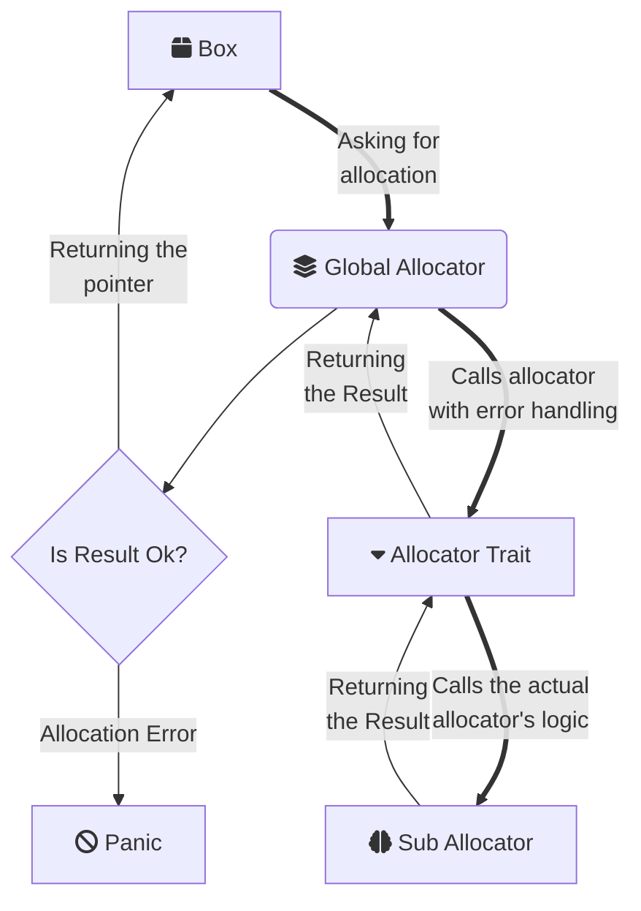

Here the Sub Allocator is just a reference to an actual allocator implementation, therefore it could be swapped out with `use` method implemented for the global allocator. Here is the same logic flow but for a deallocation:

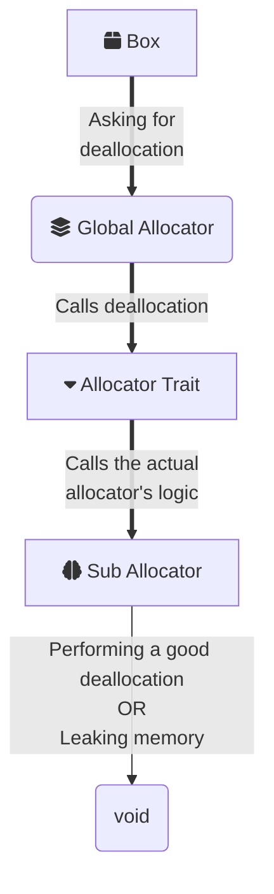

Here no result is expected, because the deallocation would either be correct or leak memory. Box just asks to deallocate itself by providing a pointer with a layout, but does not expect it to be done 100%, because there is no known heap allocator that will not suffer from external fragmentation[^footnote].
### Small recap on `critical_section!` macro
Here is how it is implemented and all it's sub-functions:

```rust
// FILE: src/kernel_components/arch_x86_64/interrupts/interrupt.rs
...
/// A macro that provides an easy way to implement critical sections.
///
/// This macro is just a wrapper around the with_int_disabled method, so it is not necessary to
/// always import it from this module. This macro can return values the same way as the method
/// does.
#[macro_export]
macro_rules! critical_section {
    ($fn:expr) => {
        unsafe {
            $crate::kernel_components::arch_x86_64::interrupts::with_int_disabled(|| {
                $fn()
            })
        }
    };
}
...
// FILE: src/kernel_components/arch_x86_64/interrupts/interrupt.rs
/// Does something with disabled interrupts.
/// 
/// This function is suitable for preventing deadlocks and other awful things that could be
/// caused via interrupts. This basically disables the software interrupts to occur, which is
/// timer interrupts and i/o s. It prevents the interrupt to cause undefined behavior of something
/// that should not be interrupted.
/// 
/// # Unsafe
/// 
/// This function is unsafe because it must be used only in a very short and atomic parts of
/// the OS logic. Overusing this will cause a latency in interrupts.
#[inline(always)]
pub unsafe fn with_int_disabled<F, T>(fun: F) -> T where F: FnOnce() -> T {
    let enabled = XFLAGSFlags::INTERRUPT_FLAG.is_in(XFLAGS::read().bits());

    if enabled {
        disable();
    }

    let output = fun();

    if enabled {
        enable();
    }

    output
}
...
// FILE: src/kernel_components/arch_x86_64/interrupts/interrupt.rs
/// Enables interrupts.
#[inline(always)]
pub unsafe fn enable() {
    unsafe { asm!("sti", options(preserves_flags, nostack)) }
}

/// Disables interrupts.
#[inline(always)]
pub unsafe fn disable() {
    unsafe { asm!("cli", options(preserves_flags, nostack)) }
}
...
```

The `XFLAGSFlags` has more complicated nature and can be found there: `src/kernel_components/registers/flags.rs`. There is no need to implement everything what XFLAGS register can do. This part of code just looks if the 9th bit of this register is set or not. This is how one can read this register:
```rust
impl XFLAGS {
    /// Reads the current flag sets of RFLAGS register.
    #[inline]
    pub fn read() -> XFLAGSFlags {
        let flags: u64;

        unsafe {
            asm!("pushfq; pop {}", out(reg) flags, options(nomem, preserves_flags));
        }

        flags.into()
    }
    ...
```

## Prerequisites

The leak allocator is an implementation of a Bump Allocator algorithm. The idea is simple and works like a stack, with only difference that it cannon pop anything off the stack. We have two pointers pointing to the start and the end of heap arena. Let's call them `start_ptr` and `end_ptr`. Those are constant throughout the whole allocation process. 

All work is done by a moving pointer `next_ptr`, that is being increased by an allocation size each time, pointing to the next area for allocation. Below is an algorithm:

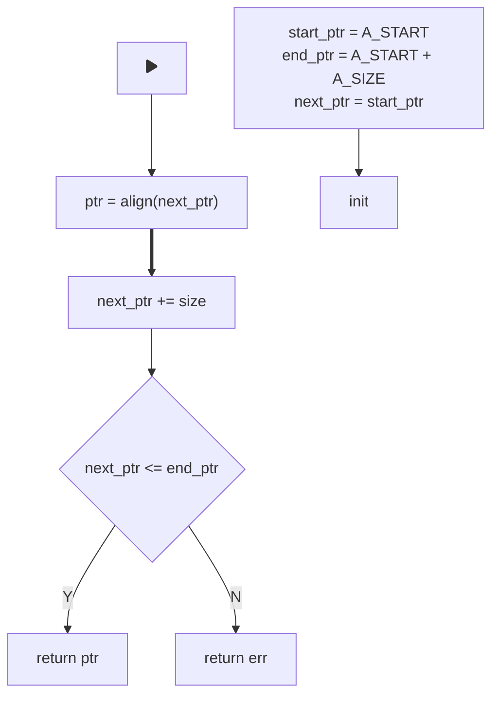

Before the code implementation, we must be aware of the following:
### Layout

A layout is a helper structure provided by this trait, which only has two fields:
- `size` - the actual size of the allocation, measured in bytes.
- `align` - alignment of the requested block of memory, measured in bytes.

An allocator's job is to find free space to fit incoming data, ensuring it does not overwrite important data and is properly aligned so the CPU can correctly read and modify it in the future. Knowing the layout of the data type is essential for performing this task properly.

It is important to understand more about this when creating variables of type `Layout`. However, if this method is called from the `GlobalAlloc` trait, it ensures that the `Layout` is always correct and can be used without caution.
### A Proper Pointer

Rust's compiler only requires a pointer, so it can insert it's code for allocation. There are three main rules that must apply for this pointer:
- it must not be a null pointer;
- it must be properly aligned;
- it must not collide with other allocations;

The first one is handled by `Allocator` trait, because we must return a `NonNull<u8>` pointer, which is a wrapper that ensures[^fn-nth-2] that pointer won't be null.

The third rule is self-explanatory. We don't want to rewrite data from another allocated value, because it will cause undefined behaviour. The compiler itself won't allow that as it remembers which memory regions were used, and would panic inside the `ptr::copy_nonoverlapping`

The second rule comes from hardware requirement of most computer systems. For fast reads and writes CPU would read values in words, not to mention all cache lines.
### Aligning the pointer

Basically aligning the pointer is conceptually similar to rounding numbers to the floor or ceiling, the only difference is that we are not aligning it to the base, but to a value defined by $align$ variable. Therefore there is two possible ways of doing it:
$$
\begin{array}
	\space\lfloor\space ptr\rfloor = ptr\space\&\space\space\sim(align - 1)\space\text{// Align down} \\
	\lceil\space ptr\rceil = (ptr\space+\space(align - 1))\space\&\space\space\sim(align - 1)\space\text{// Align up}
\end{array}
$$
where $align$ is the layout alignment obtained from the layout variable. For example let's say we have a pointer that point to address $ptr = 0$x$1004$ and we want to allocate a 64-bit integer there. Since 64-bit integer is 8 bytes, we have a $align = 8$ byte alignment. By aligning down we obtain $\space\lfloor\space ptr\rfloor = 0$x$1000$ and align up $\space\lceil\space ptr\rceil = 0$x$1008.

Each version has it's own pros and cons:
- align down - minimizes the gaps between allocations with a cost of increasing external fragmentation in long term;
- align up - bigger gaps between allocations but less external fragmentation in long term;

You can see it based on the previous example on this diagram:

<table style="border-collapse: collapse; width: 100%;">
    <tr>
        <td colspan="1" style="border: 1px solid #666; text-align: center; vertical-align: middle; padding: 10px; width: 20%; height: 50px; background-color: #333; color: #f0f0f0;">
            <div>USED<br>n Bytes</div>
        </td>
        <td colspan="1" style="border: 1px solid #666; text-align: center; vertical-align: middle; padding: 10px; width: 5%; height: 50px; background-color: #444; color: #f0f0f0;">
            <div>FREE<br>4 Bytes</div>
        </td>
        <td colspan="1" style="border: 1px solid #666; text-align: center; vertical-align: middle; padding: 10px; width: 55%; height: 50px; background-color: #333; color: #f0f0f0;">
            <div>USED<br>8 Bytes</div>
        </td>
        <td colspan="1" style="border: 1px solid #666; text-align: center; vertical-align: middle; padding: 10px; width: 20%; height: 50px; background-color: #444; color: #f0f0f0;">
            <div>FREE<br>n Bytes</div>
        </td>
    </tr>
    <tr>
        <td colspan="1" style="border: none; text-align: center; padding: 5px; height: 20px; color: #666;">
            <div>??...0x0FFC</div>
        </td>
        <td colspan="1" style="border: none; text-align: center; padding: 5px; height: 20px; color: #666;">
            <div>0x0FFC...0x1000</div>
        </td>
        <td colspan="1" style="border: none; text-align: center; padding: 5px; height: 20px; color: #666;">
            <div>0x1000...0x1008</div>
        </td>
        <td colspan="1" style="border: none; text-align: center; padding: 5px; height: 20px; color: #666;">
            <div>0x1008...??</div>
        </td>
    </tr>
</table>
We can see how data is being allocated in memory. The previous allocation end at address 0x0FFC, however next-up we have an upcoming 8-bytes allocation, therefore the address is moved to 0x1004 and aligned down to 0x1000. Between the previous allocation and a new one, there is only 4 bytes leaked.

Now let's see what happens if we align upwards:
<table style="border-collapse: collapse; width: 100%;">
    <tr>
        <td colspan="1" style="border: 1px solid #666; text-align: center; vertical-align: middle; padding: 10px; width: 10%; height: 50px; background-color: #333; color: #f0f0f0;">
            <div>USED<br>n Bytes</div>
        </td>
        <td colspan="1" style="border: 1px solid #666; text-align: center; vertical-align: middle; padding: 10px; width: 55%; height: 50px; background-color: #444; color: #f0f0f0;">
            <div>FREE<br>12 Bytes</div>
        </td>
        <td colspan="1" style="border: 1px solid #666; text-align: center; vertical-align: middle; padding: 10px; width: 30%; height: 50px; background-color: #333; color: #f0f0f0;">
            <div>USED<br>8 Bytes</div>
        </td>
        <td colspan="1" style="border: 1px solid #666; text-align: center; vertical-align: middle; padding: 10px; width: 3%; height: 50px; background-color: #444; color: #f0f0f0;">
            <div>FREE<br>n Bytes</div>
        </td>
    </tr>
    <tr>
        <td colspan="1" style="border: none; text-align: center; padding: 5px; height: 20px; color: #666;">
            <div>??...0x0FFC</div>
        </td>
        <td colspan="1" style="border: none; text-align: center; padding: 5px; height: 20px; color: #666;">
            <div>0x0FFC...0x1008</div>
        </td>
        <td colspan="1" style="border: none; text-align: center; padding: 5px; height: 20px; color: #666;">
            <div>0x1008...0x100F</div>
        </td>
        <td colspan="1" style="border: none; text-align: center; padding: 5px; height: 20px; color: #666;">
            <div>0x100F...??</div>
        </td>
    </tr>
</table>
We must align it to 0x1008, therefore leaking a whole 12 bytes of free memory. So at start it will feel like the upward alignment is always worse, and it is true for this useless allocator that cannot deallocate. 

However on long run, in normal allocators that do implement deallocation, those smaller holes are actually much bigger problem than a bigger holes, because each small hole sums up an external fragmentation. Large holes are also external fragmentation, however during the deallocation a neighbor allocated block might get freed, thus opening a larger hole when it sums up with the already existing hole. It is more chance to allocate new data within such areas.
### Fragmentation

Fragmentation is basically the amount of memory leaked. Leaked memory cannot be used to allocate new objects, even though it is technically free physical memory that shouldn't be wasted.
#### Internal Fragmentation

If a block of memory is being used to allocate some data, but this block is bigger than the requested data, all wasted space is considered an internal fragmentation. 

Consider a red block below, which is one allocated region. Two unused bytes within that block is an internal fragmentation.

<table style="border-collapse: collapse; width: 100%;">
    <tr>
        <td colspan="1" style="border: 1px solid #666; text-align: center; vertical-align: middle; padding: 10px; width: 10%; height: 50px; background-color: #333; color: #f0f0f0;">
            <div>USED<br>n Bytes</div>
        </td>
        <td colspan="1" style="border: 1px solid #666; text-align: center; vertical-align: middle; padding: 10px; width: 55%; height: 50px; background-color: #444; color: #f0f0f0; border-color: red; border-width: 3px">
            <div>USED<br>8 Bytes</div>
        </td>
        <td colspan="1" style="border: 1px solid #666; text-align: center; vertical-align: middle; padding: 10px; width: 30%; height: 50px; background-color: #333; color: #f0f0f0; border-color: red; border-width: 3px">
            <div>FREE<br>2 Bytes</div>
        </td>
        <td colspan="1" style="border: 1px solid #666; text-align: center; vertical-align: middle; padding: 10px; width: 10%; height: 50px; background-color: #444; color: #f0f0f0;">
            <div>USED<br>n Bytes</div>
        </td>
    </tr>
</table>
#### External Fragmentation

External fragmentation is an amount of memory between those allocated blocks. If you allocate values of the same type, it won't produce external fragmentation, because between each allocated block there will be zero bytes of lost memory. However it is never the case, because we always allocate stuff of different sizes, therefore external fragmentation is the most dangerous one. 

Consider All red blocks below as blocks of allocated memory. The 2 unused bytes between such blocks are considered external fragmentation. 

<table style="border-collapse: collapse; width: 100%;">
    <tr>
        <td colspan="1" style="border: 1px solid #666; text-align: center; vertical-align: middle; padding: 10px; width: 10%; height: 50px; background-color: #333; color: #f0f0f0;border-color: red; border-width: 3px">
            <div>USED<br>n Bytes</div>
        </td>
        <td colspan="1" style="border: 1px solid #666; text-align: center; vertical-align: middle; padding: 10px; width: 55%; height: 50px; background-color: #444; color: #f0f0f0; border-color: red; border-width: 3px">
            <div>USED<br>8 Bytes</div>
        </td>
        <td colspan="1" style="border: 1px solid #666; text-align: center; vertical-align: middle; padding: 10px; width: 30%; height: 50px; background-color: #333; color: #f0f0f0;">
            <div>FREE<br>2 Bytes</div>
        </td>
        <td colspan="1" style="border: 1px solid #666; text-align: center; vertical-align: middle; padding: 10px; width: 10%; height: 50px; background-color: #444; color: #f0f0f0;border-color: red; border-width: 3px">
            <div>USED<br>n Bytes</div>
        </td>
    </tr>
</table>
## The Allocation Itself

So the global allocator is nothing but a way to tell the compiler which functions it should call when doing heap allocations. Basically the only thing the compiler is hiding from our sight, is the fact that it does place allocation code for us in places where it thinks it is necessary.

It needs only one thing: a pointer to the location where object can be **safely** allocated. And to make sure it is really a safe allocation, the `Allocator` trait is used, because it allows to return a safer pointer, which is not just arbitrary, but also transfer info about the `Layout` of this allocation.

Here is how the `LeakAlloc` allocator is implemented. It is a simplest allocator that just allocates the next item after the previous one and never frees memory of any old items. So it is basically a stack that is never freed:

```rust
// FILE: src/kernel_components/memory/allocators/leak_alloc.rs
/// Leak allocator implementation
/// 
/// This allocator is suitable for kernels that do not prioritize DST too much,
/// and do not manipulate with them too much. The algorithm is the same as in the
/// Bump Allocator, except that it do not have any deallocation logic in it.
/// 
/// Use this allocator only when you are completely sure, that the DST's will always
/// live during the whole OS session or that the amount of those DST's wont cross the
/// size limit of allocator's arena.
/// 
/// # Scale
/// 
/// The size of heap arena is the same as the given at compile time. No growing methods
/// exists to make it bigger or shrink it. No additional stack space or inner heap space
/// is used at runtime.
 
use crate::single;
use super::SubAllocator;
use core::alloc::{Allocator, Layout, GlobalAlloc, AllocError};
use core::ptr::NonNull;
use core::sync::atomic::{AtomicUsize, Ordering};

/// Start address of the memory heap. Use any address as long as it is not used.
pub const LEAK_ALLOC_HEAP_START: usize = 0o_000_001_000_000_0000;
/// Maximal size of the whole arena. Adjust the size as needed.
pub const LEAK_ALLOC_HEAP_ARENA: usize = 128 * 1024;

/// Static default allocator instance
single! {
    pub LEAK_ALLOC: LeakAlloc = LeakAlloc::new(
        LEAK_ALLOC_HEAP_START,
        LEAK_ALLOC_HEAP_START + LEAK_ALLOC_HEAP_ARENA,
    );
}

/// Implementation of leaking allocator.
/// 
/// A simple memory allocation algorithm used in scenarios where you want to allocate memory 
/// sequentially without any deallocation or reallocation.
/// 
/// # Initialization
/// 
/// Initializes a pointer to the start and the end of pre-allocated heap memory region.
/// 
/// # Allocation
/// 
/// When a memory allocation request comes in returns the pointer to the next area to allocate.
/// 
/// # Deallocation
/// 
/// No deallocation is implemented for this type of allocator. It will leak memory.
/// 
/// # Fragmentation
/// 
/// This allocator will always leak memory, therefore external fragmentation will grow at full
/// maximum.
/// 
/// # Thread safety
/// 
/// Allocation is thread safe, and uses lock-free algorithm to deal with memory regions.
#[derive(Debug)]
pub struct LeakAlloc {
    // The start of the heap
    start_ptr: NonNull<u8>,
    // The end of the heap
    end_ptr: NonNull<u8>,
    // Pointer to the next object. It must be an atomic, to create a lock-free allocations.
    next_ptr: AtomicUsize,
}

impl LeakAlloc {
    /// Creates a new leaking allocator instance.
    pub fn new(heap_start: usize, heap_end: usize) -> Self {
        Self {
            start_ptr: NonNull::new(heap_start as *mut u8).unwrap(),
            end_ptr: NonNull::new(heap_end as *mut u8).unwrap(),
            next_ptr: AtomicUsize::new(heap_start),
        }
    }

    /// Returns the address of the first ptr as usize
    pub fn start_ptr_addr(&self) -> usize {
        self.start_ptr.as_ptr() as usize
    }
    
    /// Returns the address of the last ptr as usize
    pub fn end_ptr_addr(&self) -> usize {
        self.end_ptr.as_ptr() as usize
    }
}

unsafe impl Allocator for LeakAlloc {
    /// Allocates memory for DST while leaking memory.
    /// 
    /// # Thread safety
    /// 
    /// ## This allocation algorithm is lock-free:
    /// 
    /// Every thread that wants to allocate some memory will enter a loop, in which they
    /// will get a pointer to next available memory address. All what they should do is just
    /// change this ptr to the next address for the next allocation to occur, and if they
    /// manage to do so, they will get the memory region.
    /// 
    /// Thread might loose it's chance to obtain address, if and only if, another thread obtained
    /// it faster which caused the CAS operation to fail.
    /// 
    fn allocate(&self, layout: Layout) -> Result<NonNull<[u8]>, AllocError> {
        // Calculate a mask to enforce the required alignment.
        let align_mask = !(layout.align() - 1);

        loop {
            // Loads the current state of next ptr.
            let current_next_ptr = self.next_ptr.load(Ordering::Relaxed);
            let start_alloc = current_next_ptr & align_mask;
            let mut end_alloc = start_alloc.saturating_add(layout.size());

            if end_alloc <= self.end_ptr_addr() {
                #[cfg(debug_assertions)] {
                    crate::println!("Allocating {} bytes at {:#x}", layout.size(), current_next_ptr);
                }
                if let Ok(cas_current_next) = self.next_ptr.compare_exchange(
                    current_next_ptr,
                    end_alloc,
                    Ordering::SeqCst,
                    Ordering::Relaxed,
                ) {
                    return Ok(NonNull::slice_from_raw_parts(
                        NonNull::new(cas_current_next as *mut u8).unwrap(),
                        layout.size(),
                    ));
                }
            } else {
                return Err(AllocError)
            }
        }
    }

    /// Leak allocator cannot deallocate anything.
    unsafe fn deallocate(&self, ptr: NonNull<u8>, layout: Layout) {
        // Leak memory
    }
}

impl SubAllocator for LeakAlloc {
    fn arena_size(&self) -> usize {
        LEAK_ALLOC_HEAP_ARENA
    }

    fn heap_addr(&self) -> usize {
        LEAK_ALLOC_HEAP_START
    }
}
```

The top part is easy to follow. We have a structure that holds a pointer to the start and the end of heap (`start_ptr`, `end_ptr`). It also holds `next_ptr`, which is an atomic integer that would point to the next place for allocation.

At the very bottom we are implementing a `SubAllocator` trait for `LeakAlloc`, which actually looks the same for all allocators at this moment.

The most important part is the actual implementation of `Allocator` trait, and as was mentioned earlier, the deallocation is not required, so here it just does nothing and leaks memory. `allocate` method is the most interesting here:
```rust
...
fn allocate(&self, layout: Layout) -> Result<NonNull<[u8]>, AllocError> {
        // Calculate a mask to enforce the required alignment.
        let align_mask = !(layout.align() - 1);

        loop {
            // Loads the current state of next ptr.
            let current_next_ptr = self.next_ptr.load(Ordering::Relaxed);
            let start_alloc = current_next_ptr & align_mask;
            let end_alloc = start_alloc.saturating_add(layout.size());

            if end_alloc <= self.end_ptr_addr() {
                #[cfg(debug_assertions)] {
                    crate::println!("Allocating {} bytes at {:#x}", layout.size(), current_next_ptr);
                }
                if let Ok(cas_current_next) = self.next_ptr.compare_exchange(
                    current_next_ptr,
                    end_alloc,
                    Ordering::SeqCst,
                    Ordering::Relaxed,
                ) {
                    return Ok(NonNull::slice_from_raw_parts(
                        NonNull::new(cas_current_next as *mut u8).unwrap(),
                        layout.size(),
                    ));
                }
            } else {
                return Err(AllocError)
            }
        }
    }
...
```

This trait is useful because it allows to return an error if a heap is full for example. With such useless allocator that never deallocates, it would become a problem very fast.

```rust
let align_mask = !(layout.align() - 1);
```
{: .nolineno }

The first line calculates the align mask to perform down alignment in the end.

The whole code is in a loop, because it is a lock-free implementation. This is why it is not necessary to hide a global allocator behind a mutex or other synchronization primitive. The algorithm itself will ensure mutual exclusion to the `next_ptr`, which means only one value could be allocated at a time.

If the CAS exchange operation succeed, we are ready to return pointer to a fresh memory region. If not, then we must retry again. A failure of this CAS operation only means that some other thread successfully allocated something, which means that the whole system's productivity is still increasing.
## Static Array Allocator

To free unused memory and prevent memory leaks, we must keep track of every allocated memory region and free them accordingly. The simplest way to achieve this is by creating a static array of booleans, which mark whether the memory region they represent is allocated or not.

The algorithm will iterate over nodes and decrease the size needed to allocate the data by node's size. If node is free, then the size is decreased, otherwise, the size is returned to a starting value.

If size is successfully decreased to a value smaller than a size of a single node, that means we found a chain of free nodes and ready to allocate memory within them. We shall mark the whole chain of such nodes as used (change their bool flag), and return aligned pointer.

Below is a whole algorithm diagram:

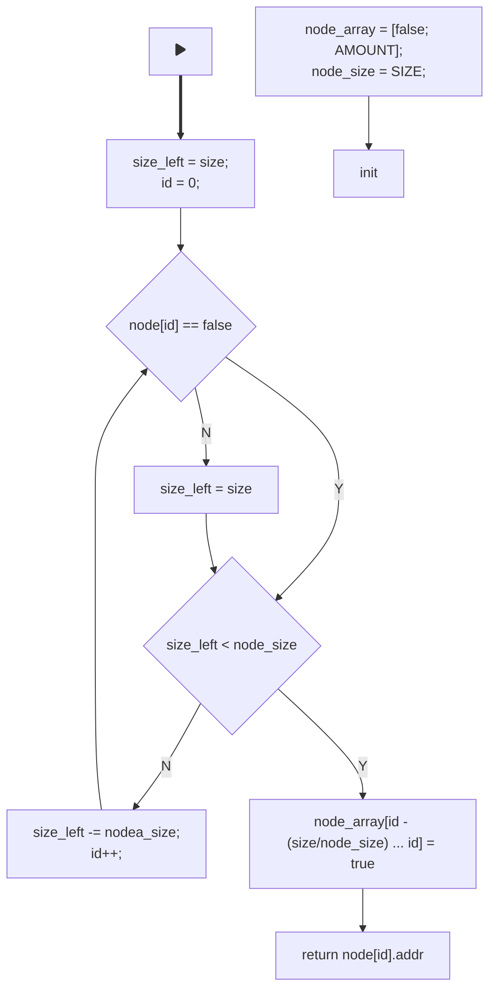

Now the deallocation mechanism. It is much easier because all allocated nodes are owned by the box, which called the deallocation. During deallocation we have a pointer where our data is located and a layout. This way we can easily find which node is a starting one, and how many nodes there are left to mark as unused.

Below is a diagram:

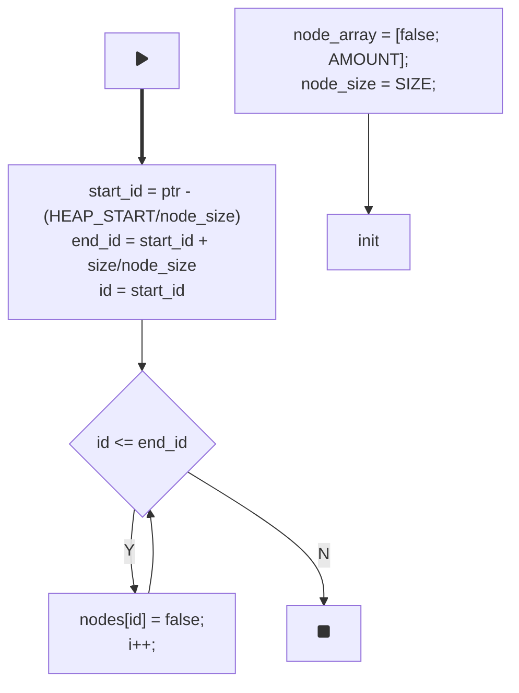

The `node_alloc.rs` contains an implementation of such an allocator. It is as fast as the previous one and indeed frees the heap. However, the more nodes you use in this array, the less stack memory you will have available. Larger blocks result in worse internal fragmentation, while smaller blocks reduce the total amount of memory available. Below is how it is implemented in notOS:
```Rust
// FILE: src/kernel_components/memory/allocators/node_alloc.rs
/// Node allocator implementation
/// 
/// This is a fast allocator that can deallocate memory for further
/// reuse, while not overheading the system with hard algorithms, but
/// sacrificing the stack memory to control every single node of memory. 
/// This allocator holds every memory node inside the stack and marks them 
/// as used or not. It has to know exactly the size of each node, that can 
/// be chosen only at compile time.
/// 
/// Both allocation and deallocation is supported and can be used in systems
/// that work rapidly with DST's, in the cost of stack memory.
/// 
/// # Important
/// 
/// The amount of nodes must be decided at compile time.
/// 
/// # Scale
/// 
/// This allocator must have an incredible small heap, or incredibly big node size.
/// 
/// For better understanding examine this allocator config:
/// const NODE_AMOUNT: usize = 128; 
/// const NODE_SIZE: usize = 4; // 4 bytes for one node.
/// 
/// From this constants we get that:
/// pub const NODE_ALLOC_HEAP_ARENA: usize = NODE_AMOUNT * NODE_SIZE; // = 512 bytes of heap memory.
/// 
/// However the stack memory for this allocator will be:
/// size_of::<MemoryNode> = 16;
/// STACK_SIZE = 16 * 128 = 2048.
/// 
/// To make heap memory actually bigger than used stack memory, the node size must be bigger than 16 bytes.
/// However this would lead to big amount of external fragmentation, when allocating a lot of small objects,
/// so it is better to use this allocator when you need a fast, but small heap.

use crate::single;
use super::SubAllocator;
use core::alloc::{Allocator, Layout, AllocError};
use core::mem::{self, MaybeUninit};
use core::ptr::{self, NonNull};
use core::sync::atomic::{AtomicUsize, AtomicBool, Ordering};
use core::cell::UnsafeCell;
use core::marker::PhantomData;

/// Start address of the memory heap. Use any address as long as it is not used.
pub const NODE_ALLOC_HEAP_START: usize = 0o_000_001_000_000_0000;
/// Maximal size of the whole arena.
pub const NODE_ALLOC_HEAP_ARENA: usize = NODE_AMOUNT * NODE_SIZE;
/// Overall amount of nodes in the allocator. The arena size of allocator will be decided as NODE_AMOUNT * NODE_SIZE.
const NODE_AMOUNT: usize = 128;
/// The size of a single node. When smaller number is used, the external fragmentation is getting less frequent, but the
/// overall performance, will decrease.
const NODE_SIZE: usize = 8;

/// Static default allocator instance
single! {
    pub NODE_ALLOC: NodeAlloc = NodeAlloc::new(
        NODE_ALLOC_HEAP_START,
        NODE_SIZE,
    );
}

/// Implementation of node allocator.
/// 
/// A simple memory allocation algorithm that deallocates memory fast with the use of
/// stack memory to contain every single memory node within.
/// 
/// # Initialization
/// 
/// Initializes a pointer to the first node. Every single node is initialized at compile time.
/// 
/// # Allocation
/// 
/// When a memory allocation request comes in returns the pointer to the next node and marks it as
/// used. If several nodes needed to contain one object, all of them will be marked as used.
/// 
/// # Deallocation
/// 
/// Deallocates memory by marking the nodes as unused. The next allocation will be within those nodes,
/// if they do fit inside.
/// 
/// # Fragmentation
/// 
/// This allocator has several problems with external and internal fragmentation. If the object is
/// smaller than the node, entire node will still be marked as used. This can lead to internal fragmentation
/// within the node, because the area needed can be bigger than requested. If many small objects will take nodes
/// in non linear order, it can lead to external fragmentation for bigger objects, which cannot fit between gaps.
/// When using this allocator, the node size must be chosen wisely, as the most expected memory chunk size, used
/// is the system. (If the OS will not use big memory chunks, the allocator will overflow fast, with some
/// small sized data, like integers. When deciding which size to use, it should be close to the memory size
/// of the most used data type in your system.). Making the node size too small, can lead to storing too much
/// data on the stack and worse performance.
/// 
/// # Thread safety
/// 
/// Both allocation and deallocation are lock-free and thread safe. More info on allocate and deallocate.
#[derive(Debug)]
pub struct NodeAlloc {
    // The array located on stack, that holds information about every single memory node.
    node_array: [MemoryNode; NODE_AMOUNT],
    // The size of one node.
    node_size: usize,
}

impl NodeAlloc {
    /// Creates a new node allocator instance.
    pub fn new(heap_start: usize, node_size: usize) -> Self {
        let array = {
            let mut array: [MaybeUninit<MemoryNode>; NODE_AMOUNT] = unsafe { MaybeUninit::uninit().assume_init() };
            
            for (i, node) in array.iter_mut().enumerate() {
                node.write(MemoryNode::new(heap_start + node_size * i));
            }

            unsafe { mem::transmute::<_, [MemoryNode; NODE_AMOUNT]>(array) }
        };

        Self {
            node_array: array,
            node_size,
        }
    }
}

unsafe impl Allocator for NodeAlloc {
    /// Allocates memory for DST by searching for free nodes in the node array.
    /// 
    /// # Thread safety
    /// 
    /// ## This allocation algorithm is lock-free:
    /// 
    /// Every thread would first find the area that is suitable for the requested memory
    /// size, then try to mark all the nodes, in which the object will be placed, as used.
    /// 
    /// If the thread manages to do it before the other threads, it will obtain the pointer,
    /// to allocated memory nodes. If not, it will clean all the wrong marked allocations,
    /// and retry the whole process again.
    fn allocate(&self, layout: Layout) -> Result<NonNull<[u8]>, AllocError> {
        // Calculate a mask to enforce the required alignment.
        let align_mask = !(layout.align() - 1);

        // The main loop that tries to obtain memory before other threads do so first.
        'main: loop {
            // Size left to allocate.
            let mut leftover_size = layout.size();
            let mut id = self.node_array.len();

            for node in self.node_array.iter().rev() {

                if id + layout.size() - 1 / self.node_size >= self.node_array.len() {
                    id -= 1;
                    continue
                }

                // Check if the node is already in use.
                if !node.used.load(Ordering::Acquire) {
                    if leftover_size <= self.node_size {
                        let mut cas_counter = 1;

                        // Checking array bounds.
                        let right_id = if layout.size() > self.node_size {
                                                layout.size() / self.node_size
                                            } else { 1 };

                        // Trying to change every single node flag that we want to allocate.
                        for current_node in self.node_array[id - 1 .. id + right_id - 1].iter() {
                            // If we encounter an error while doing cas operations, it would only mean that the other thread
                            // is allocated this memory node faster that us. Therefore, we must clean up those fake allocations,
                            // that we did, and try again from the very start.
                            if let Err(_) = current_node.used.compare_exchange(
                                false,
                                true,
                                Ordering::SeqCst,
                                Ordering::Relaxed,
                            ) {
                                // Since we already made those fake allocations ourselves, we own them, therefore
                                // we can easily clean them, without the need of cas operations.
                                for broken_node in self.node_array[id - 1 .. id + cas_counter - 1].iter() {
                                    broken_node.used.store(false, Ordering::Release)
                                }

                                continue 'main
                            }
                            cas_counter += 1;
                        }

                        #[cfg(debug_assertions)] {
                            crate::println!("Allocating {} bytes at {:#x}", layout.size(), node.addr);
                        }

                        // After all nodes are noted as used, return the pointer to the first node.
                        return Ok(NonNull::slice_from_raw_parts(
                            NonNull::new((node.addr & align_mask) as *mut u8).unwrap(),
                            layout.size(),
                        ));
                    }

                    leftover_size -= self.node_size
                }

                id -= 1;
            }

            return Err(AllocError)
        }
    }

    /// Allocates memory for DST by marking the node, in which the object was placed before, as unused.
    /// 
    /// # Thread safety
    /// 
    /// ## This allocation algorithm is lock-free:
    /// 
    /// The thread will try to mark every single used node, within the allocated region as unused,
    /// with the use of cas operations. If it does fail, then some other thread did it first, and we
    /// must just do nothing.
    unsafe fn deallocate(&self, ptr: NonNull<u8>, layout: Layout) {
        let start_id = (ptr.as_ptr() as usize - NODE_ALLOC_HEAP_START) / self.node_size; 
        let end_id = start_id + layout.size() / self.node_size;
        
        #[cfg(debug_assertions)] {
            crate::println!("Deallocating {} bytes from {:#x}", layout.size(), ptr.as_ptr() as usize);
        }

        // Since we own the allocated memory region, we can simply deallocate the memory
        // nodes with cas operations, and it would fail only when other thread did so first.
        for node in self.node_array[start_id..end_id + 1].iter() {
            if let Err(_) = node.used.compare_exchange(
                true,
                false,
                Ordering::SeqCst,
                Ordering::Relaxed
            ) {
                break
            }
        }
    }
}

impl SubAllocator for NodeAlloc {
    fn arena_size(&self) -> usize {
        NODE_ALLOC_HEAP_ARENA
    }

    fn heap_addr(&self) -> usize {
        NODE_ALLOC_HEAP_START
    }
}

/// A single node that says info about the current state of memory.
#[derive(Debug)]
struct MemoryNode {
    // Virtual memory address of the current node in the heap.
    addr: usize,
    // This flag will be set to true, when the allocator, is ready to give the memory
    // pointer.
    used: AtomicBool,
}

impl MemoryNode {
    pub fn new(addr: usize) -> Self {
        Self { addr, used: AtomicBool::new(false) }
    }
}
```


Since deallocation is owned by the value, which called this method, we can forget about concurrency in the deallocation implementation.

The code differs from the provided algorithm by a little detail. It decrements the `id` variable, so it can mark nodes instantly, without the need of calculating where the first node was. This allows to make this allocation algorithm thread safe.
## Free List Allocator

Thus far allocator was useless due to the problems they lead to, that's it is important to spend more time on something better. To implement a really good allocator it must use more complex data structure to keep track of regions.

When you think of memory regions, you could imagine them to be empty containers for your data values. Let's say We have a tiny 1 Kb heap somewhere:
<table style="border-collapse: collapse; width: 100%;">
    <tr>
        <td colspan="1" style="border: 1px solid #666; text-align: center; vertical-align: middle; padding: 10px; height: 50px; background-color: #333; color: #f0f0f0;">
            <div>FREE<br>1024 Bytes</div>
        </td>
    </tr>
    <tr>
        <td colspan="1" style="border: none; text-align: center; padding: 5px; height: 20px; color: #666;">
            <div>0x1000...0x1400</div>
        </td>
    </tr>
</table>
Now we allocate several values of different sizes and it becomes something like so:
<table style="border-collapse: collapse; width: 100%;">
    <tr>
        <td colspan="1" style="border: 1px solid #666; text-align: center; vertical-align: middle; padding: 10px; width: 10%; height: 50px; background-color: #333; color: #f0f0f0; border-color: red; border-width: 3px">
            <div>USED<br>4 Bytes</div>
        </td>
        <td colspan="1" style="border: 1px solid #666; text-align: center; vertical-align: middle; padding: 10px; width: 20%; height: 50px; background-color: #444; color: #f0f0f0; border-color: red; border-width: 3px">
            <div>USED<br>8 Bytes</div>
        </td>
        <td colspan="1" style="border: 1px solid #666; text-align: center; vertical-align: middle; padding: 10px; width: 5%; height: 50px; background-color: #333; color: #f0f0f0; border-color: red; border-width: 3px">
            <div>USED<br>2 Bytes</div>
        </td>
        <td colspan="1" style="border: 1px solid #666; text-align: center; vertical-align: middle; padding: 10px; width: 90%; height: 50px; background-color: #444; color: #f0f0f0;">
            <div>FREE<br>1010 Bytes</div>
        </td>
    </tr>
    <tr>
        <td colspan="1" style="border: none; text-align: center; width: 3%; padding: 5px; height: 20px; color: #666;">
            <div>0x1000...0x1004</div>
        </td>
        <td colspan="1" style="border: none; text-align: center; width: 5%; padding: 5px; height: 20px; color: #666;">
            <div>0x1004...0x100C</div>
        </td>
        <td colspan="1" style="border: none; text-align: center; width: 1%; padding: 5px; height: 20px; color: #666;">
            <div>0x100C...0x100E</div>
        </td>
        <td colspan="1" style="border: none; text-align: center; width: 90%; padding: 5px; height: 20px; color: #666;">
            <div>0x100E...0x1400</div>
        </td>
    </tr>
</table>
Now let's say several memory regions was freed after a proper deallocation:

<table style="border-collapse: collapse; width: 100%;">
    <tr>
        <td colspan="1" style="border: 1px solid #666; text-align: center; vertical-align: middle; padding: 10px; width: 10%; height: 50px; background-color: #333; color: #f0f0f0;">
            <div>FREE<br>4 Bytes</div>
        </td>
        <td colspan="1" style="border: 1px solid #666; text-align: center; vertical-align: middle; padding: 10px; width: 20%; height: 50px; background-color: #444; color: #f0f0f0; border-color: red; border-width: 3px">
            <div>USED<br>8 Bytes</div>
        </td>
        <td colspan="1" style="border: 1px solid #666; text-align: center; vertical-align: middle; padding: 10px; width: 5%; height: 50px; background-color: #333; color: #f0f0f0;">
            <div>FREE<br>2 Bytes</div>
        </td>
        <td colspan="1" style="border: 1px solid #666; text-align: center; vertical-align: middle; padding: 10px; width: 90%; height: 50px; background-color: #444; color: #f0f0f0;">
            <div>FREE<br>1010 Bytes</div>
        </td>
    </tr>
    <tr>
        <td colspan="1" style="border: none; text-align: center; width: 3%; padding: 5px; height: 20px; color: #666;">
            <div>0x1000...0x1004</div>
        </td>
        <td colspan="1" style="border: none; text-align: center; width: 5%; padding: 5px; height: 20px; color: #666;">
            <div>0x1004...0x100C</div>
        </td>
        <td colspan="1" style="border: none; text-align: center; width: 1%; padding: 5px; height: 20px; color: #666;">
            <div>0x100C...0x100E</div>
        </td>
        <td colspan="1" style="border: none; text-align: center; width: 90%; padding: 5px; height: 20px; color: #666;">
            <div>0x100E...0x1400</div>
        </td>
    </tr>
</table>
Now there is 3 free memory regions of different sizes. Now instead of thinking in blocks, let's think in nodes, where each free block is pointing at the next free one sequentially, creating a list data structure:
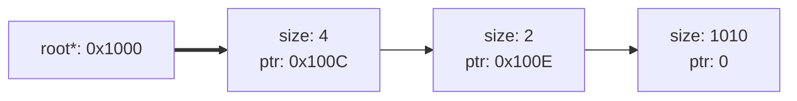

Each node contains an available size within the node and a pointer to the next free node. In this situation we clearly see that there is no allocated gap between last two nodes. 

This is important because this way we can *merge* them into a one block of bigger size. This perfectly prevents external fragmentation and also reduces the amount of bytes to represent the node itself:

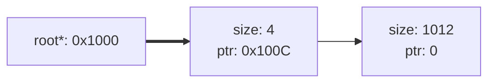
This merging ability allows us to represent the initial state of the heap as a single huge block of free memory

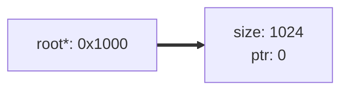

### Proper Node Pointers

It is always a good idea to use atomic integers[^fn-nth-3] as pointer, as they would allow to perform allocations and deallocations at the same time, if a proper lock-free algorithm is implemented.

Let's see what happens if a some block goes free:

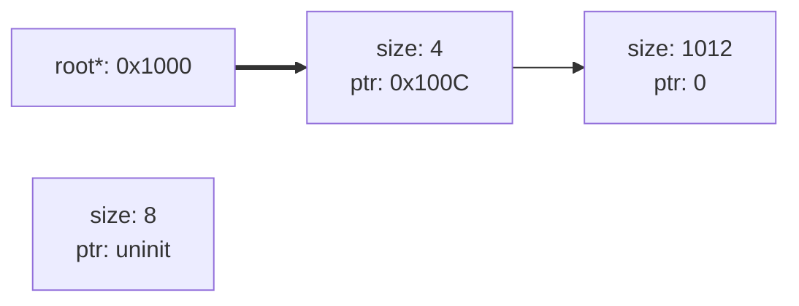

The deallocator must create a new node with a size of 8 bytes that will be freed. Afterwards it must insert this block in the list, so that other threads, which might iterate over it at that moment, would not feel the difference. This is the key moment why **atomic integers**[^fn-nth-3] must be used.

Firstly we must find where our node must be. To do this we traverse through each free node and check addresses of next free node. If it is bigger than the address we want to deallocate, then our new node must be in between those two nodes. If not, then we keep iterating. For example we know that this node must be before the last node, therefore it's pointer must point to the last node:

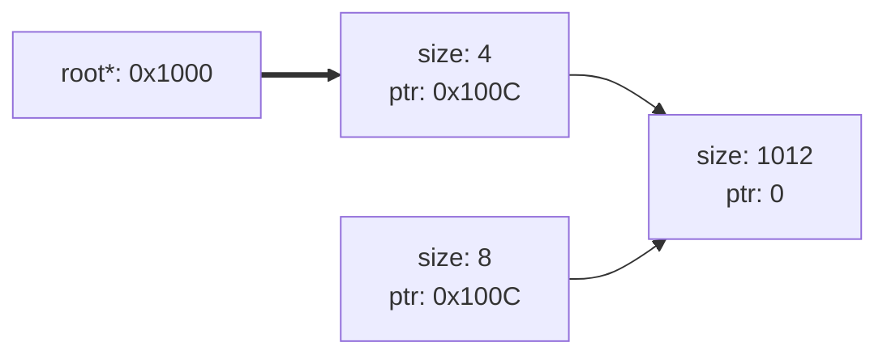
So after we know where our node should be standing, we must do one last thing, and do it atomically. We must change the pointer of the node, that previously pointed to the node, which is in front of us:

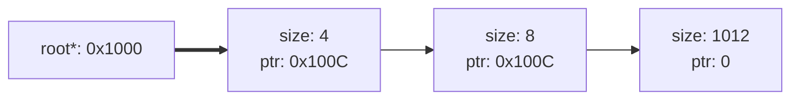

After that it would be good to merge all of them, since they are sequential and there is no gaps in between.

### So The Algorithm...

Here is the algorithm diagram for allocation method:
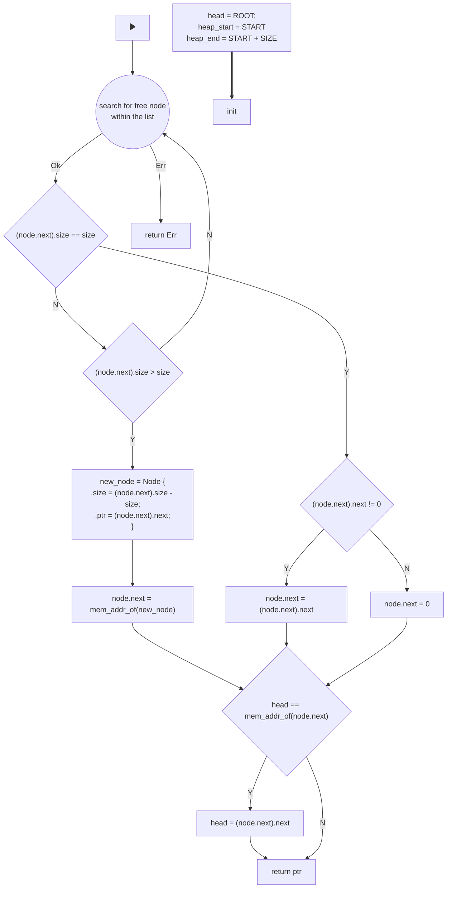

> Since from this moment allocators starting to use harder algorithms only partial code snippets will be provided. 
{: .prompt-warning }

So to allocate something we need to find a suitable free node. Well this part is implementation dependent. In notOS a custom enum `SearchStrategy` is being defined for such purpose:
```rust
/// Search strategies that allocator can use.
#[allow(non_camel_case_types)]
#[derive(Debug, Clone, Copy, PartialEq, Eq)]
pub enum SearchStrategy {
    /// This search strategy looks for the first available memory block in the linked list that 
    /// is large enough to satisfy the allocation request. It stops searching once it finds a 
    /// suitable block. This strategy is simple but may lead to memory fragmentation.
    FIRST_FIT,
    /// The best-fit strategy searches for the smallest available memory block that can accommodate
    /// the allocation request. It aims to minimize fragmentation but may require more time to 
    /// search for the best-fitting block.
    BEST_FIT,
    /// In contrast to the best-fit strategy, the worst-fit strategy searches for the largest 
    /// available memory block. This can potentially lead to less fragmentation but may also 
    /// result in less efficient memory usage.
    WORST_FIT,
    /// Next fit is similar to first fit but remembers the last block searched in the linked 
    /// list. It starts searching from the last block, which can help improve allocation locality.
    NEXT_FIT,
}
```

All those are self-explanatory and you are most likely would want to use `BEST_FIT` option to prevent external fragmentation as much as possible. Based on chosen search strategy, this allocator behaves differently.

> Having such flexibility is actually useful. For example some wrapper could be built on top of this allocator, that would just track the amount of nodes in the list. If there this value is too small, then the `FIRST_FIT` will be a very fast choice as it does not requires to traverse across the whole list and search for the smallest possible block. The `NEXT_FIT` in such situation would be even more welcome, because it would completely ignore first nodes, even if something was freed there. Then if the amount of nodes are becoming larger `BEST_FIT` should be used, because fragmentation problems are becoming more significant.
> {: .prompt-tip }

Now here is how such strategies are implemented in notOS:

```rust
...
match self.search_strategy {
    FIRST_FIT | NEXT_FIT => {
        if node.size > layout.size() {
            let new_node = NodeHeader::new(
                ((node as *const NodeHeader as usize + 1) + NODE_HEADER_SIZE + layout.size()) & align_mask,
                node.next.load(Ordering::Relaxed),
                node.size - layout.size(),
            );

            if let Err(_) = prev_node.next.compare_exchange(
                node as *const _ as usize,
                new_node,
                Ordering::SeqCst,
                Ordering::Relaxed,
            ) {
                if let Err(_) = prev_node.next.compare_exchange(
                    0,
                    new_node,
                    Ordering::SeqCst,
                    Ordering::Relaxed,
                ) {
                    unsafe { ptr::drop_in_place(new_node as *mut NodeHeader); }
                    continue 'main;
                }
            }

            break 'inner;
        } else if node.size == layout.size() {
            let next_node = node.next.load(Ordering::Relaxed);
            if let Err(_) = prev_node.next.compare_exchange(
                node as *const _ as usize,
                next_node,
                Ordering::SeqCst,
                Ordering::Relaxed,
            ) {
                if let Err(_) = prev_node.next.compare_exchange(
                    0,
                    next_node,
                    Ordering::SeqCst,
                    Ordering::Relaxed,
                ) {
                    unsafe { ptr::drop_in_place(next_node as *mut NodeHeader); }
                    continue 'main;
                }
            }

            break 'inner;
        }
    },
    BEST_FIT => {
        if node.size == layout.size() {
            let next_node = node.next.load(Ordering::Relaxed);
            if let Err(_) = prev_node.next.compare_exchange(
                node as *const _ as usize,
                next_node,
                Ordering::SeqCst,
                Ordering::Relaxed,
            ) {
                if let Err(_) = prev_node.next.compare_exchange(
                    0,
                    next_node,
                    Ordering::SeqCst,
                    Ordering::Relaxed,
                ) {
                    unsafe { ptr::drop_in_place(next_node as *mut NodeHeader); }
                    continue 'main;
                }
            }

            break 'inner;
        } else if node.size > layout.size() {
            let next_node = node.next.load(Ordering::Relaxed);
            
            if node.size < prev_node.size {
                fit_node = node.ref_clone();
            }

            if next_node == 0 {
                let new_node = NodeHeader::new(
                    ((fit_node as *const NodeHeader as usize + 1) + NODE_HEADER_SIZE + layout.size()) & align_mask,
                    fit_node.next.load(Ordering::Relaxed),
                    fit_node.size - layout.size(),
                );

                if let Err(_) = prev_node.next.compare_exchange(
                    fit_node as *const _ as usize,
                    new_node,
                    Ordering::SeqCst,
                    Ordering::Relaxed,
                ) {
                    if let Err(_) = prev_node.next.compare_exchange(
                        0,
                        new_node,
                        Ordering::SeqCst,
                        Ordering::Relaxed,
                    ) {
                        unsafe { ptr::drop_in_place(new_node as *mut NodeHeader); }
                        continue 'main;
                    }
                }

                break 'inner;
            }
        }
    },
    _ => {},
}

prev_node = node.ref_clone();
node = unsafe {
    if let Some(next_node) = (node.next.load(Ordering::SeqCst) as *mut NodeHeader).as_mut() {
        next_node
    } else {
        if self.search_strategy == NEXT_FIT {
            if let Ok(_) = self.next_fit_ptr.compare_exchange(
                self.next_fit_ptr.load(Ordering::Acquire),
                self.head.load(Ordering::Acquire),
                Ordering::SeqCst,
                Ordering::Relaxed,
            ) {
                continue 'main;
            }
        }

        return Err(AllocError);
    }
};
...
```

Their main purpose is to find a **node that points to a free node**. This is important that we should not find the free node itself, because we must also mutate the previous one.

All of them first check if there is enough space for the allocation within the node. Here are always 3 possibilities:
- size > node.size - not enough size, search for next bigger one (if it is not `BEST_FIT`, otherwise return `Err`);
- size == node.size - a perfect matching node! First we change the pointer from the previous node to a next one from the one that is about to be removed (if it exist, otherwise it is a tail with ptr = 0). Basically we are causing previous node to jump over our node.
- size < node.size - the most complicated one. We must divide the note into two. One will be the size of the allocation and the other will be the size of what is left. The second (leftover) node should also point to the next node from the very start. In the end we must atomically change the previous node's pointer to our second made node (leftover).

In the end it is always important to move the ROOT/HEAD pointer if the first node was allocated or divided:
```rust
// If this cas operation will fail, it will only mean that some other thread
// did it first or the current node is not a head, therefore it must be failed.
self.head.compare_exchange(
    node as *const _ as usize,
    node.next.load(Ordering::Relaxed),
    Ordering::SeqCst,
    Ordering::Relaxed,
);

if self.search_strategy == SearchStrategy::NEXT_FIT {
    self.next_fit_ptr.compare_exchange(
        self.next_fit_ptr.load(Ordering::Acquire),
        node.next.load(Ordering::Relaxed),
        Ordering::SeqCst,
        Ordering::Relaxed,
    );
}

let return_ptr = (node as *const _ as usize + NODE_HEADER_SIZE) & align_mask;

#[cfg(debug_assertions)]
{
    crate::println!("Allocating {} bytes at {:#x}", layout.size(), return_ptr);
}

return Ok(NonNull::slice_from_raw_parts(
    NonNull::new(return_ptr as *mut u8).unwrap(),
    layout.size(),
));
```

> Really strong allocators are fast and reduce external fragmentation as much as possible, however their source code size could become significantly larger than one module and could even be large size projects. To reduce the complexity it is easier to implement a thread-unsafe version of the allocator and concentrate on the algorithm itself. 
> Lock-free algorithms are not a must, especially if threads won't perform many allocations at once. Once a solid version is crafted, one could think of rewriting it in a lock-free way to remove the need of locking some fields behind a synchronization primitive.
> {: .prompt-tip }

This is a full code of the `allocate` method:
```rust
/// Allocates memory in a free node.
/// 
/// # Thread safety
/// 
/// ## This allocation algorithm is lock-free:
/// 
/// Every thread that wants to allocate memory iterates through the free memory list, gets the free node, and
/// splits it into two if the requested memory is smaller than the obtained node. It returns the split one
/// that can contain the requested layout. If the requested memory is the same as the node size, it just returns the node and marks it as used.
fn allocate(&self, layout: Layout) -> Result<NonNull<[u8]>, AllocError> {
    // Calculate a mask to enforce the required alignment.
    let align_mask = !(layout.align() - 1);

    // The main loop for catching the current head.
    'main: loop {
        let current_head = if self.search_strategy == SearchStrategy::NEXT_FIT {
            self.next_fit_ptr.load(Ordering::Relaxed)
        } else {
            self.head.load(Ordering::Relaxed)
        };

        // Trying to fetch a head node. It can only fail if the head was changed in between
        // those two operations or the first node is not initialized yet.
        if let Some(mut node) = unsafe { (current_head as *mut NodeHeader).as_mut() } {
            // We need the previous node to compare and pointer swapping.
            let mut prev_node = node.ref_clone();
            // This variable will only be used when best fit or worst fit mode is enabled.
            let mut fit_node = node.ref_clone();
            
            // Inner loop for searching within the nodes.
            'inner: loop {
                use SearchStrategy::*;
                // Based on the selected strategy, the inner code will vary.
                match self.search_strategy {
                    FIRST_FIT | NEXT_FIT => {
                        if node.size > layout.size() {
                            let new_node = NodeHeader::new(
                                ((node as *const NodeHeader as usize + 1) + NODE_HEADER_SIZE + layout.size()) & align_mask,
                                node.next.load(Ordering::Relaxed),
                                node.size - layout.size(),
                            );

                            if let Err(_) = prev_node.next.compare_exchange(
                                node as *const _ as usize,
                                new_node,
                                Ordering::SeqCst,
                                Ordering::Relaxed,
                            ) {
                                if let Err(_) = prev_node.next.compare_exchange(
                                    0,
                                    new_node,
                                    Ordering::SeqCst,
                                    Ordering::Relaxed,
                                ) {
                                    unsafe { ptr::drop_in_place(new_node as *mut NodeHeader); }
                                    continue 'main;
                                }
                            }

                            break 'inner;
                        } else if node.size == layout.size() {
                            let next_node = node.next.load(Ordering::Relaxed);
                            if let Err(_) = prev_node.next.compare_exchange(
                                node as *const _ as usize,
                                next_node,
                                Ordering::SeqCst,
                                Ordering::Relaxed,
                            ) {
                                if let Err(_) = prev_node.next.compare_exchange(
                                    0,
                                    next_node,
                                    Ordering::SeqCst,
                                    Ordering::Relaxed,
                                ) {
                                    unsafe { ptr::drop_in_place(next_node as *mut NodeHeader); }
                                    continue 'main;
                                }
                            }

                            break 'inner;
                        }
                    },
                    BEST_FIT => {
                        if node.size == layout.size() {
                            let next_node = node.next.load(Ordering::Relaxed);
                            if let Err(_) = prev_node.next.compare_exchange(
                                node as *const _ as usize,
                                next_node,
                                Ordering::SeqCst,
                                Ordering::Relaxed,
                            ) {
                                if let Err(_) = prev_node.next.compare_exchange(
                                    0,
                                    next_node,
                                    Ordering::SeqCst,
                                    Ordering::Relaxed,
                                ) {
                                    unsafe { ptr::drop_in_place(next_node as *mut NodeHeader); }
                                    continue 'main;
                                }
                            }

                            break 'inner;
                        } else if node.size > layout.size() {
                            let next_node = node.next.load(Ordering::Relaxed);
                            
                            if node.size < prev_node.size {
                                fit_node = node.ref_clone();
                            }

                            if next_node == 0 {
                                let new_node = NodeHeader::new(
                                    ((fit_node as *const NodeHeader as usize + 1) + NODE_HEADER_SIZE + layout.size()) & align_mask,
                                    fit_node.next.load(Ordering::Relaxed),
                                    fit_node.size - layout.size(),
                                );

                                if let Err(_) = prev_node.next.compare_exchange(
                                    fit_node as *const _ as usize,
                                    new_node,
                                    Ordering::SeqCst,
                                    Ordering::Relaxed,
                                ) {
                                    if let Err(_) = prev_node.next.compare_exchange(
                                        0,
                                        new_node,
                                        Ordering::SeqCst,
                                        Ordering::Relaxed,
                                    ) {
                                        unsafe { ptr::drop_in_place(new_node as *mut NodeHeader); }
                                        continue 'main;
                                    }
                                }

                                node = fit_node;
                                break 'inner;
                            }
                        }
                    }
                    _ => unimplemented!(),
                }

                prev_node = node.ref_clone();
                node = unsafe {
                    if let Some(next_node) = (node.next.load(Ordering::SeqCst) as *mut NodeHeader).as_mut() {
                        next_node
                    } else {
                        if self.search_strategy == NEXT_FIT {
                            if let Ok(_) = self.next_fit_ptr.compare_exchange(
                                self.next_fit_ptr.load(Ordering::Acquire),
                                self.head.load(Ordering::Acquire),
                                Ordering::SeqCst,
                                Ordering::Relaxed,
                            ) {
                                continue 'main;
                            }
                        }

                        return Err(AllocError);
                    }
                };
            }

            // If this CAS operation fails, it means some other thread did it first,
            // or the current node is not a head, hence it must fail.
            self.head.compare_exchange(
                node as *const _ as usize,
                node.next.load(Ordering::Relaxed),
                Ordering::SeqCst,
                Ordering::Relaxed,
            );

            if self.search_strategy == SearchStrategy::NEXT_FIT {
                self.next_fit_ptr.compare_exchange(
                    self.next_fit_ptr.load(Ordering::Acquire),
                    node.next.load(Ordering::Relaxed),
                    Ordering::SeqCst,
                    Ordering::Relaxed,
                );
            }
            
            let return_ptr = (node as *const _ as usize + NODE_HEADER_SIZE) & align_mask;
            
            #[cfg(debug_assertions)]
            {
                crate::println!("Allocating {} bytes at {:#x}", layout.size(), return_ptr);
            }
            
            return Ok(NonNull::slice_from_raw_parts(
                NonNull::new(return_ptr as *mut u8).unwrap(),
                layout.size(),
            ));
        } else {
            // This condition will be called only once at the first allocation. This ensures that
            // next allocations will be faster and will not require checking this every time.
            if let Ok(_) = self.initialized.compare_exchange(
                false,
                true,
                Ordering::SeqCst,
                Ordering::Relaxed,
            ) {
                let _ = NodeHeader::new(
                    self.heap_start & align_mask,
                    0,
                    self.arena_size(),
                );

                self.head.compare_exchange(
                    0,
                    self.heap_start,
                    Ordering::SeqCst,
                    Ordering::Relaxed,
                );

                self.next_fit_ptr.compare_exchange(
                    0,
                    self.heap_start,
                    Ordering::SeqCst,
                    Ordering::Relaxed,
                );
            }
        }
    }
}

```

With only one strategy chosen the code can become much smaller but would loose this flexibility of choosing the search method at runtime. Also in this code, the first ever node is being allocated only at the first call of `allocate` method. It is made that way because the OS might use a different allocator rather than this one, and there, so there is no reason to allocate this node from the very start.

### List Without a Heap?

From this point something might not match. Everything is perfect, except that a list implementation that creates those nodes and removes unneeded ones, must also work on a heap. So it is a some sort of chicken and egg problem, which has several solutions:
- second allocator - using a smaller second allocator with a custom heap dedicated for it to save all nodes within itself. This solution is too complex and is not worth it.
- heapless data structures - using some data structures from crates like `heapless`, which allows to use heapless alternatives to regular collections. This is a solid choice with only one limit - each collection is a fixed capacity data structure, therefore it cannot grow beyond the allocated size and must throw error of some sort if there is too much nodes there or panic.
- write nodes with the data - this solution is being used within the implementation in notOS. Instead of thinking how to allocate some data of size `X`, we think how to allocate some data of size `(X + NODE_SIZE)`, where `NODE_SIZE` is in bytes. This way we actually manually write the node at the place where we wish to write a data, and increasing out pointer by adding the `NODE_SIZE`. This solution means that the nodes would take memory within the heap, which increases an external fragmentation, however those nodes has to be written somewhere anyway.

In this implementation an allocator is literally a list itself. Here is how each node is defined:
```rust
/// A structure that represents the node, within which the memory will be written.
#[derive(Debug)]
#[repr(C)]
struct NodeHeader {
    // The node's size must be known to fit the requested memory into the block.
    size: usize,
    // pointer to the next available list.
    next: AtomicUsize,
}

impl NodeHeader {
    #[inline(always)]
    fn new(self_ptr: usize, next_ptr: usize, size: usize) -> usize {
        let node = NodeHeader { size, next: AtomicUsize::new(next_ptr) };

        unsafe {
            ptr::write_unaligned(
                self_ptr as *mut NodeHeader, 
                node,
            )
        }
        
        self_ptr
    }
}
```

It is important to represent this structure as a C-like struct, so we can read it straight from the memory where it was written. each such node is being written straight to a place by provided pointer. This function is called each time we divide a node into two.

### Deallocation and Merging

Deallocation is always much easier, however this is a first time where deallocation also helps the allocator overall. In this implementation the deallocator also merges nodes, which are linearly staying one after another with no gaps.

Because deallocate method is doing something to nodes that it does not own, it must be done atomically or using synchronization primitives. Here is an algorithm for deallocation:
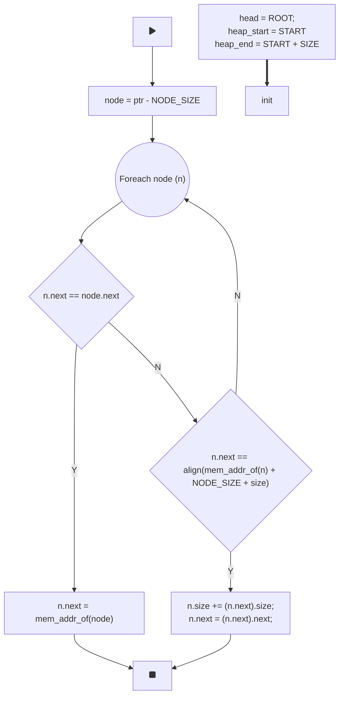

At this point you can see that writing nodes straight before the allocation itself can be worth it, even though some tough problems related to pointer alignment may appear.

When using this technique it is easy to check if the pointer is actually pointing to the next node after this one. If it is, then we must increase the size of this node, so that the allocator can see it as a bigger node. Then we shall change the pointer of this node to the next one after the upcoming one.

> The whole code for this allocator could be found [here](https://github.com/not-forest/notOS/blob/master/src/kernel_components/memory/allocators/free_list_alloc.rs).
{: .prompt-info }

## Buddy Allocator

This one is classic[^fn-nth-4]. From external fragmentation's perspective it is a much better solution than a free list one. Let's look at our block:

<table style="border-collapse: collapse; width: 100%;">
    <tr>
        <td colspan="1" style="border: 1px solid #666; text-align: center; vertical-align: middle; padding: 10px; height: 50px; background-color: #333; color: #f0f0f0;">
            <div>FREE<br>1024 Bytes</div>
        </td>
    </tr>
    <tr>
        <td colspan="1" style="border: none; text-align: center; padding: 5px; height: 20px; color: #666;">
            <div>0x1000...0x1400</div>
        </td>
    </tr>
</table>

Let's say we wish to allocate 32 byte-sized structure. Basically what we do is divide this block in half until we cannot go further:

<table style="border-collapse: collapse; width: 100%">
    <!-- Initial full block -->
    <tr>
        <td colspan="32" style="border: 1px solid #666; text-align: center; vertical-align: middle; padding: 10px; height: 50px; background-color: #333; color: #f0f0f0;">
            <div>FREE<br>1024 Bytes</div>
        </td>
    </tr>
    <tr>
        <td colspan="32" style="border: none; text-align: center; padding: 5px; height: 20px; color: #666;">
            <div>0x1000...0x1400</div>
        </td>
    </tr>
    <!-- After first split -->
    <tr>
        <td colspan="16" style="border: 1px solid #666; text-align: center; vertical-align: middle; padding: 10px; height: 50px; background-color: #333; color: #f0f0f0;">
            <div>FREE<br>512 Bytes</div>
        </td>
        <td colspan="16" style="border: 1px solid #999; text-align: center; vertical-align: middle; padding: 10px; height: 50px;">
            <div>FREE<br>512 Bytes</div>
        </td>
    </tr>
    <tr>
        <td colspan="16" style="border: none; text-align: center; padding: 5px; height: 20px; color: #666;">
            <div>0x1000...0x1200</div>
        </td>
        <td colspan="16" style="border: none; text-align: center; padding: 5px; height: 20px; color: #666;">
            <div>0x1200...0x1400</div>
        </td>
    </tr>
    <!-- After second split -->
    <tr>
        <td colspan="8" style="border: 1px solid #666; text-align: center; vertical-align: middle; padding: 10px; height: 50px; background-color: #333; color: #f0f0f0;">
            <div>FREE<br>256 Bytes</div>
        </td>
        <td colspan="8" style="border: 1px solid #999; text-align: center; vertical-align: middle; padding: 10px; height: 50px;">
            <div>FREE<br>256 Bytes</div>
        </td>
        <td colspan="16" style="border: 1px solid #999; text-align: center; vertical-align: middle; padding: 10px; height: 50px;">
            <div>FREE<br>512 Bytes</div>
        </td>
    </tr>
    <tr>
        <td colspan="8" style="border: none; text-align: center; padding: 5px; height: 20px; color: #666;">
            <div>0x1000...0x1100</div>
        </td>
        <td colspan="8" style="border: none; text-align: center; padding: 5px; height: 20px; color: #666;">
            <div>0x1100...0x1200</div>
        </td>
        <td colspan="16" style="border: none; text-align: center; padding: 5px; height: 20px; color: #666;">
            <div>0x1200...0x1400</div>
        </td>
    </tr>
    <!-- After third split -->
    <tr>
        <td colspan="4" style="border: 1px solid #666; text-align: center; vertical-align: middle; padding: 10px; height: 50px; background-color: #333; color: #f0f0f0;">
            <div>FREE<br>128 Bytes</div>
        </td>
        <td colspan="4" style="border: 1px solid #999; text-align: center; vertical-align: middle; padding: 10px; height: 50px;">
            <div>FREE<br>128 Bytes</div>
        </td>
        <td colspan="8" style="border: 1px solid #999; text-align: center; vertical-align: middle; padding: 10px; height: 50px;">
            <div>FREE<br>256 Bytes</div>
        </td>
        <td colspan="16" style="border: 1px solid #999; text-align: center; vertical-align: middle; padding: 10px; height: 50px;">
            <div>FREE<br>512 Bytes</div>
        </td>
    </tr>
    <tr>
        <td colspan="4" style="border: none; text-align: center; padding: 5px; height: 20px; color: #666;">
            <div>0x1000...0x1080</div>
        </td>
        <td colspan="4" style="border: none; text-align: center; padding: 5px; height: 20px; color: #666;">
            <div>0x1080...0x1100</div>
        </td>
        <td colspan="8" style="border: none; text-align: center; padding: 5px; height: 20px; color: #666;">
            <div>0x1100...0x1200</div>
        </td>
        <td colspan="16" style="border: none; text-align: center; padding: 5px; height: 20px; color: #666;">
            <div>0x1200...0x1400</div>
        </td>
    </tr>
    <!-- After fourth split -->
    <tr>
        <td colspan="2" style="border: 1px solid #666; text-align: center; vertical-align: middle; padding: 10px; height: 50px; background-color: #333; color: #f0f0f0;">
            <div>FREE<br>64 Bytes</div>
        </td>
        <td colspan="2" style="border: 1px solid #999; text-align: center; vertical-align: middle; padding: 10px; height: 50px;">
            <div>FREE<br>64 Bytes</div>
        </td>
        <td colspan="4" style="border: 1px solid #999; text-align: center; vertical-align: middle; padding: 10px; height: 50px;">
            <div>FREE<br>128 Bytes</div>
        </td>
        <td colspan="8" style="border: 1px solid #999; text-align: center; vertical-align: middle; padding: 10px; height: 50px;">
            <div>FREE<br>256 Bytes</div>
        </td>
        <td colspan="16" style="border: 1px solid #999; text-align: center; vertical-align: middle; padding: 10px; height: 50px;">
            <div>FREE<br>512 Bytes</div>
        </td>
    </tr>
    <tr>
        <td colspan="2" style="border: none; text-align: center; padding: 5px; height: 20px; color: #666;">
            <div>0x1000...0x1040</div>
        </td>
        <td colspan="2" style="border: none; text-align: center; padding: 5px; height: 20px; color: #666;">
            <div>0x1040...0x1080</div>
        </td>
        <td colspan="4" style="border: none; text-align: center; padding: 5px; height: 20px; color: #666;">
            <div>0x1080...0x1100</div>
        </td>
        <td colspan="8" style="border: none; text-align: center; padding: 5px; height: 20px; color: #666;">
            <div>0x1100...0x1200</div>
        </td>
        <td colspan="16" style="border: none; text-align: center; padding: 5px; height: 20px; color: #666;">
            <div>0x1200...0x1400</div>
        </td>
    </tr>
    <!-- After fifth split -->
    <tr>
        <td colspan="1" style="border: 1px solid #666; text-align: center; vertical-align: middle; padding: 10px; height: 50px; background-color: #F15; color: #f0f0f0;">
            <div>USED<br>32 Bytes</div>
        </td>
        <td colspan="1" style="border: 1px solid #999; text-align: center; vertical-align: middle; padding: 10px; height: 50px;">
            <div>FREE<br>32 Bytes</div>
        </td>
        <td colspan="2" style="border: 1px solid #999; text-align: center; vertical-align: middle; padding: 10px; height: 50px;">
            <div>FREE<br>64 Bytes</div>
        </td>
        <td colspan="4" style="border: 1px solid #999; text-align: center; vertical-align: middle; padding: 10px; height: 50px;">
            <div>FREE<br>128 Bytes</div>
        </td>
        <td colspan="8" style="border: 1px solid #999; text-align: center; vertical-align: middle; padding: 10px; height: 50px;">
            <div>FREE<br>256 Bytes</div>
        </td>
        <td colspan="16" style="border: 1px solid #999; text-align: center; vertical-align: middle; padding: 10px; height: 50px;">
            <div>FREE<br>512 Bytes</div>
        </td>
    </tr>
    <tr>
        <td colspan="1" style="border: none; text-align: center; padding: 5px; height: 20px; color: #666;">
            <div>0x1000...0x1020</div>
        </td>
        <td colspan="1" style="border: none; text-align: center; padding: 5px; height: 20px; color: #666;">
            <div>0x1020...0x1040</div>
        </td>
        <td colspan="2" style="border: none; text-align: center; padding: 5px; height: 20px; color: #666;">
            <div>0x1040...0x1080</div>
        </td>
        <td colspan="4" style="border: none; text-align: center; padding: 5px; height: 20px; color: #666;">
            <div>0x1080...0x1100</div>
        </td>
        <td colspan="8" style="border: none; text-align: center; padding: 5px; height: 20px; color: #666;">
            <div>0x1100...0x1200</div>
        </td>
        <td colspan="16" style="border: none; text-align: center; padding: 5px; height: 20px; color: #666;">
            <div>0x1200...0x1400</div>
        </td>
    </tr>
</table>

At first it may look strange, but it's main super power is the deallocation. When a block of memory is freed, it's neighbor is also freed, and it goes all the way to the root. From this perspective it is already obvious, that a data structure required for this is a classical binary tree.

Because we are always dividing by two, we can define a size of a memory block during the allocation and deallocation, so our nodes won't have to contain information about their size. Here is a single buddy allocator's node/header:
```rust
/// A single node of the buddy allocator's binary tree
///
/// Like in regular binary tries, each node points to their
/// two neighbors. If pointers are null pointers, that means
/// this node is a leaf. The struct itself is pretty bulky, but
/// it is a must, otherwise, the main algorithm will be changed.
#[derive(Debug)]
#[repr(C)]
struct BuddyHeader {
    // pointer to the right block, if exist.
    right: AtomicUsize,
    // pointer to the left block, if exist.
    left: AtomicUsize,
    // A current status of the buddy.
    status: BuddyStatus,
}

impl BuddyHeader {
    #[inline(always)]
    fn new(self_ptr: usize, left: usize, right: usize) -> usize {
        let node = BuddyHeader {
            left: AtomicUsize::new(left),
            right: AtomicUsize::new(right),
            status: BuddyStatus::FREE,
        };

        unsafe {
            ptr::write_unaligned(
                self_ptr as *mut BuddyHeader, 
                node,
            )
        }
        
        self_ptr
    }
...
```

So we need two pointer to move around left or right and a special status. This field would help us determine, in which direction to move and a current status of underlying nodes. This is how it is defined:
```rust
/// Four states in which a buddy can be.
///
/// Each status gives a proper info to the allocator,
/// so new allocations will appear in right places.
#[derive(Debug, Clone, Copy, PartialEq, Eq)]
enum BuddyStatus {
    /// Basically mean a whole free clean block.
    FREE,
    /// Tells the allocator to search on the left.
    LEFT,
    /// Tells the allocator to search on the right.
    RIGHT,
    /// Tells the allocator that both buddies are allocated.
    BLOCKED,
}
```

By default all nodes have `FREE` status. It means that the node is still not divided into two buddies During this status both pointers are null. Once the node is divided into buddies, it would have a `LEFT` status, because left side has higher priority. 

Each buddy is also a node with `FREE` status by default. If node is marked as `BLOCKED` it means that it is either allocated, or it's buddies and sub buddies are allocated. If left side goes `BLOCKED`, node will have `RIGHT` status and continue on the right side. This way both sides are getting allocated with values and `BLOCKED` status signals parent nodes that this path is already allocated.

Let's look at the algorithm from more detailed perspective:
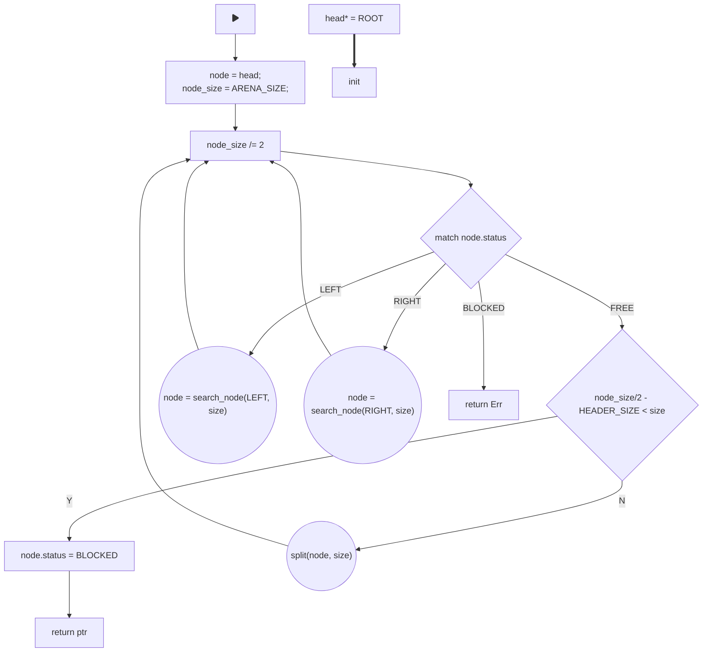

So we first we obtain the root/header node via a pointer. And then goes the algorithm:

#### Checking the status

first we check the status of a node. If it is `BLOCKED`, then we are done with an error that the heap is full. If it is `LEFT` or `RIGHT` we just follow the pointer and rewriting `node = ...` as new node obtain from this pointer. After that we must divide size by two, because we have just moved down one level deeper. If it is `FREE` then two possibilities occur:
- don't divide further - if the block divided by two would result two blocks which are too small for this allocation, that means we must use it by marking it as `BLOCKED`
- divide and repeat - if the block divided by two would result two blocks which's size are still sufficient for the requested data type, divide and mark the current node to `LEFT`.

### Buddy Allocation

For now let's look at the allocation implementation:
```rust
/// Allocates memory in a free node.
/// 
/// # Thread safety
/// 
/// ## This allocation algorithm is lock-free:
///
/// Only one writer can split the FREE node into two parts. No readers would be able to
/// move on until the node is split apart by the writer.
fn allocate(&self, layout: Layout) -> Result<NonNull<[u8]>, AllocError> {
    // Calculate a mask to enforce the required alignment.
    let align_mask = !(layout.align() - 1);

    let mut size = self.arena_size() - BUDDY_HEADER_SIZE;
    // Trying to obtain the head.
    //
    // This can only fail at the very first allocation, where there is still no
    // main header. This will also fail, if there is no more memory to allocate.
    'main: loop {
        if let Some(mut node) = unsafe { (self.head.load(Ordering::Acquire) as *mut BuddyHeader).as_mut() } {
            'inner: loop {
                match node.status {
                    BuddyStatus::FREE => {
                        // If no further division is possible, allocating the buddy.
                        if (size / 2).saturating_sub(BUDDY_HEADER_SIZE) < layout.size() {
                            // Marking as used.
                            node.status = BuddyStatus::BLOCKED;

                            let return_ptr = (node as *const _ as usize + BUDDY_HEADER_SIZE) & align_mask;

                            #[cfg(debug_assertions)]
                            {
                                crate::println!("Allocating {} bytes at {:#x}, with node size of: {} bytes.", layout.size(), return_ptr, size);
                            }

                            return Ok(NonNull::slice_from_raw_parts(
                                NonNull::new(return_ptr as *mut u8).unwrap(),
                                layout.size(),
                            ));
                        } else {
                            // If possible, dividing in half, and repeating.
                            node.split(self.arena_size(), align_mask, size);
                            continue 'inner;
                        }
                    },
                    s @ (BuddyStatus::LEFT | BuddyStatus::RIGHT) => {
                        // Calling the inner function of the node, which will be recursive.
                        if let Ok(n) = node.search(s, self.arena_size(), layout.size(), &mut size) {
                            node = n;
                            continue 'inner;
                        }

                        // The node is split, but the allocation is too big for both sides.
                        return Err(AllocError);
                    },
                    BuddyStatus::BLOCKED => {
                        // At this point the whole heap is full or fragmented.
                        return Err(AllocError);
                    }
                }
            }
        } else {
            // This condition will be only called once at the first allocation. This ensures that
            // next allocations will be faster and will not require to check this every time.
            if let Ok(_) = self.initialized.compare_exchange(
                false,
                true,
                Ordering::SeqCst,
                Ordering::Relaxed,
            ) {
                let _ = BuddyHeader::new(
                    self.heap_start & align_mask,
                    0,
                    0,
                );

                self.head.compare_exchange(
                    0,
                    self.heap_start,
                    Ordering::SeqCst,
                    Ordering::Relaxed,
                );
            }
        }
    }

    // This part must be unreachable.
    unreachable!("Broke out of the main loop.");
}
```

This one is much smaller than the free list one, because there is always one search strategy. One important variable is `size`, which is being written to a value of heap size from the start. This variable would be divided by two, each time we proceed further down the binary tree. This way we keep track of the size and don't have to hold size inside the nodes.

We are entering an infinite loop, where firstly we obtain the root node. Just like last type, the root node is written onto the heap only when first allocation call occur.

The algorithm itself is located in `'inner` loop. We match the current node's status. If it is `FREE`, we then look if we could divide it further into buddies, with `node.split(..)` method. If the node is already too small to divide further, we mark it as blocked and return the allocation.

If node's status is `LEFT` or `RIGHT`, we call a `node.search(..)` method on it. It will check the side that was chosen and return a next node reference. Then we simply mutate our `node` mutable reference value, and continuing the loop.

> Note that we always divide `size` variable after searching for the next node. This is because each time we proceed further down the tree, we are traversing through smaller nodes. In other words, if we call search `n` times, then the size of the current node is `HEAP_SIZE/n.
{: .prompt-warning }

The `BLOCKED` status here can only be obtained when 

### How splitting works

Both `split`, `merge` and `search` are methods of the `BuddyHeader` structure (node). Split is easier than others, so we would look at it first:
```rust
#[inline(always)]
fn split(&mut self, arena_size: usize, align_mask: usize, size: usize) {
    self.status = BuddyStatus::LEFT; // Starting with left first.

    // Allocating the left buddy.
    let lptr = (self as *const BuddyHeader as usize) + BUDDY_HEADER_SIZE; 
    // Allocating the right buddy.
    let rptr = lptr + (size / 2); 

    let left_buddy = BuddyHeader::new(
        lptr & align_mask,
        0, 0,
    );

    let right_buddy = BuddyHeader::new(
        rptr & align_mask,
        0, 0,
    );

    // Now we can change the pointers.
    self.left.fetch_update(Ordering::SeqCst, Ordering::SeqCst, |_| Some(left_buddy));
    self.right.fetch_update(Ordering::SeqCst, Ordering::SeqCst, |_| Some(right_buddy));
}
```

Just like previously, it's implementation depends if you are writing nodes manually within the heap with the allocated values, or using some heapless structures or additional heap.

For this implementation we firstly put a `LEFT` status. This is important, because after this no other thread would try to split the node and try to find the left buddy. Even if they fail, due to the fact that this thread was too slow, they would try again, so it is thread safe.

We are placing the left buddy just after our one, by adding `BUDDY_HEADER_SIZE` value. The right buddy is being placed in the middle of the node. 

Imagine a memory block of size 256 bytes, with one buddy header (node). If we split it we obtain two memory regions, each with buddy header and 92 bytes of :  

<table style="border-collapse: collapse; width: 100%;">
    <tr>
        <!-- BUDDY HEADER 24 Bytes -->
        <td colspan="1" style="border: 1px solid #666; text-align: center; vertical-align: middle; padding: 10px; width: 10%; height: 50px; background-color: #444; color: #f0f0f0;">
            <div>BUDDY HEADER<br>24 Bytes</div>
        </td>
        <td colspan="1" style="border: 1px solid #666; text-align: center; vertical-align: middle; padding: 10px; width: 10%; height: 50px; background-color: #444; color: #f0f0f0;">
            <div>BUDDY HEADER<br>24 Bytes</div>
        </td>
        <!-- FREE 92 Bytes -->
        <td colspan="5" style="border: 1px solid #666; text-align: center; vertical-align: middle; padding: 10px; width: 50%; height: 50px; background-color: #333; color: #f0f0f0;">
            <div>FREE<br>92 Bytes</div>
        </td>
        <!-- BUDDY HEADER 24 Bytes -->
        <td colspan="1" style="border: 1px solid #666; text-align: center; vertical-align: middle; padding: 10px; width: 10%; height: 50px; background-color: #444; color: #f0f0f0;">
            <div>BUDDY HEADER<br>24 Bytes</div>
        </td>
        <!-- FREE 92 Bytes -->
        <td colspan="5" style="border: 1px solid #666; text-align: center; vertical-align: middle; padding: 10px; width: 50%; height: 50px; background-color: #333; color: #f0f0f0;">
            <div>FREE<br>92 Bytes</div>
        </td>
    </tr>
    <tr>
        <!-- Address Ranges -->
        <td colspan="1" style="border: none; text-align: center; padding: 5px; height: 20px; color: #666;">
            <div>0x1000...0x1017</div>
        </td>
        <td colspan="1" style="border: none; text-align: center; padding: 5px; height: 20px; color: #666;">
            <div>0x1017...0x102E</div>
        </td>
        <td colspan="5" style="border: none; text-align: center; padding: 5px; height: 20px; color: #666;">
            <div>0x102E...0x1070</div>
        </td>
        <td colspan="1" style="border: none; text-align: center; padding: 5px; height: 20px; color: #666;">
            <div>0x1070...0x1087</div>
        </td>
        <td colspan="5" style="border: none; text-align: center; padding: 5px; height: 20px; color: #666;">
            <div>0x1087...0x10C0</div>
        </td>
    </tr>
</table>
### Search Method

Both `search` and `merge` methods are recursive, therefore can be complicated to implement. Here is how it might look like:

```rust
#[inline(never)]
fn search(
    &mut self,
    mut status: BuddyStatus,
    arena_size: usize,
    alloc_size: usize,
    size: &mut usize
) -> Result<&mut BuddyHeader, ()> {
    // If the node is divided, checking the left side first and then the right
    // one. Other splitted nodes are in high priority, as they do not require
    // further splitting for buddies.

    let mut tries = 0;
    'main: loop {
        let mut side = match status {
            BuddyStatus::RIGHT => self.right.load(Ordering::Acquire),
            BuddyStatus::LEFT => self.left.load(Ordering::Acquire),
            _ => unreachable!(),
        };

        // Amount of tries before exiting this block.
        if tries > 2 {
            break 'main;
        }

        if let Some(next_buddy) = unsafe { (side as *mut BuddyHeader).as_mut() } {
            match next_buddy.status {
                l @ BuddyStatus::LEFT => {
                    if (*size / 2).saturating_sub(BUDDY_HEADER_SIZE) >= alloc_size {
	                    *size = (*size / 2).saturating_sub(BUDDY_HEADER_SIZE);
                        // Going to all different leaves until finding suitable place.
                        if let Ok(n) = next_buddy.search(l, arena_size, alloc_size, size) {
                            self.status = BuddyStatus::RIGHT;
                            return Ok(n);
                        }
                    }
                    status = BuddyStatus::RIGHT; // Trying to change side.
                    tries += 1;
                },
                r @ BuddyStatus::RIGHT => {
                    if (*size / 2).saturating_sub(BUDDY_HEADER_SIZE) >= alloc_size {
	                    *size = (*size / 2).saturating_sub(BUDDY_HEADER_SIZE);
                        // Going to all different leaves until finding suitable place.
                        if let Ok(n) = next_buddy.search(r, arena_size, alloc_size, size) {
                            self.status = BuddyStatus::LEFT;
                            return Ok(n);
                        }
                    }
                    status = BuddyStatus::LEFT; // Trying to change side.
                    tries += 1;
                },
                BuddyStatus::FREE => {
	                *size = (*size / 2).saturating_sub(BUDDY_HEADER_SIZE);
                    return Ok(next_buddy);
                }, // We cannot go wrong with a free one.
                BuddyStatus::BLOCKED => {
                    if status != BuddyStatus::RIGHT {
                        return self.search(BuddyStatus::RIGHT, arena_size, alloc_size, size);
                    } else {
                        break 'main;
                    }
                },
            }
        } else {
            // This can only happen in a multi-threaded environment. Repeating.
            continue 'main;
        }
    }

    Err(())
}
```

So we have a `side` to pick and a current node's size. First we try a side, that was obtained as an argument. After getting the node from that side, we check it's status. If it is divided, then we check if we can go any further. If it is free, then we return it 100%, because there is no way it's size won't be enough.

We increment the `tries` to prevent infinite loops that would check both sides forever. Note that if node is not free, we are searching a node inside this node by calling the same function. Note that the size is getting divided by two each time we go further. This way it can traverse the whole binary tree, to the leaves, and if some of them would be big enough for allocation, return it back.

For better understanding, here is a diagram of this logic:
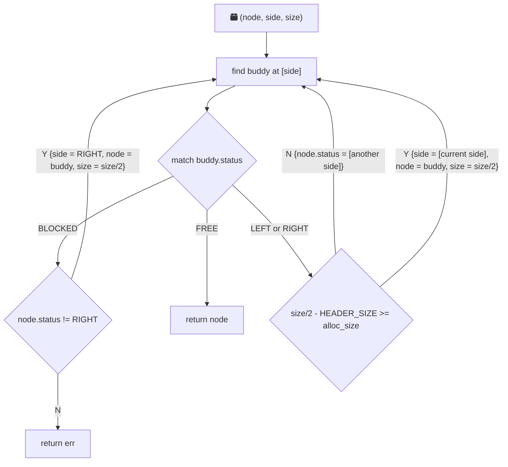

It would always call itself with deeper nodes, therefore size must be divided by two each new call. This function would try to find a header with `FREE` status inside every single branch from all sides.

> Even though a tree structure is larger and more complex than a simple list, it is much easier to find and deallocate nodes. This is because we always allocate blocks in sizes that are powers of two. Consequently, this can lead to internal fragmentation for structures whose size is not a power of two. For example, to allocate a 24-byte structure, we would need to use a 32-byte block, resulting in 8 bytes of wasted memory.
{: .prompt-info }

### Deallocation

Thankfully the deallocation is not that hard. All we have to do is mark node's status to be `FREE` again. However it is important to merge all nodes back after this. This is being handled by `node.merge(..)` method:

```rust
/// Deallocates the memory by setting the given node as unused.
///
/// While searching for the requested memory from the top, this function merges all buddies
/// that are freed, including the one which is about to be freed by this function call.
unsafe fn deallocate(&self, ptr: NonNull<u8>, layout: Layout) {
    #[cfg(debug_assertions)] {
        crate::println!("Deallocating {} bytes from {:#x}", layout.size(), ptr.as_ptr() as usize);
    }

    let node_ptr = (ptr.as_ptr() as usize).saturating_sub(BUDDY_HEADER_SIZE);

    // Mark the node as freed.
    if let Some(n) = (node_ptr as *mut BuddyHeader).as_mut() {
        n.status = BuddyStatus::FREE;
    }

    // Merge the node with its buddies.
    if let Some(mut node) = unsafe { (self.head.load(Ordering::Acquire) as *mut BuddyHeader).as_mut() } {
        node.merge(BuddyStatus::BLOCKED, node_ptr as usize, layout.size());
    }
}
```

### Merging Buddies

Merge buddies is simple. We should look at the status of `left` and `right` pointers, and if they are both `FREE`, mark our node free. For it to be effective, we create `merge` method, which should traverse through the proper branch and merge all neighbors.

It should do the following:
- Move through a specific branch, that would lead to the node, which should be freed. To do this we always check the address of a current node, and move left or right accordingly;
- When freed node is found, mark it as free, move one level up, then try to merge two neighbors. If successful, move one level up, then try to merge two neighbors again. If failed, just stop.

Here is the algorithm:
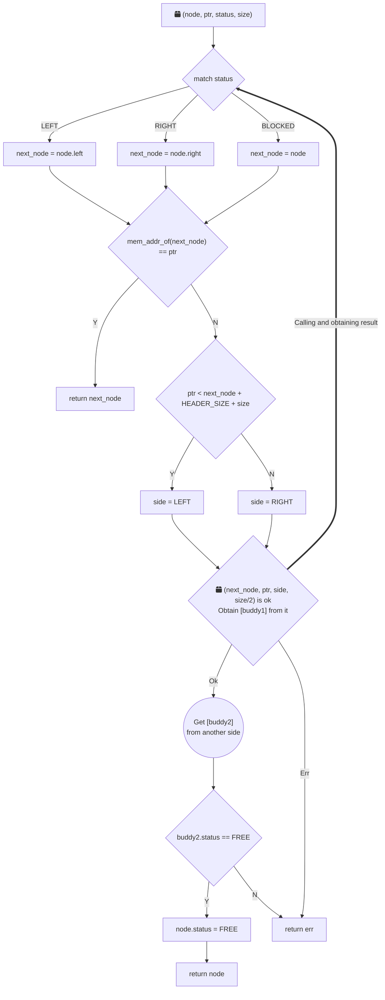

Basically we will call this function, until we find the node that was freed. Then we return Ok(free_node) with that free node. Then previous calls would obtain this result, and check a node on another side. It it is also `FREE`, it will mark the the node `FREE`, which is the node higher in this hierarchy. Then return Ok(free_node) again so that previous call could do exactly the same. This will go on until they would reach some node that is not `FREE` or reach the tree's root.

This is how it is implemented:
```rust
#[inline(never)]
unsafe fn merge(
    &mut self,
    status: BuddyStatus,
    merge_ptr: usize,
    size: usize
) -> Result<(&mut BuddyHeader, &mut BuddyHeader), ()> {
    'main: loop {
        let side = match status {
            BuddyStatus::RIGHT => self.right.load(Ordering::Acquire),   // Going right.
            BuddyStatus::LEFT => self.left.load(Ordering::Acquire),     // Going left.
            BuddyStatus::BLOCKED => self as *const _ as usize,          // Going for the head.
            _ => unreachable!(),
        };

        if let Some(next_buddy) = unsafe { (side as *mut BuddyHeader).as_mut() } {
            // Checking for the requested buddy.
            if side == merge_ptr {
                return Ok((self, next_buddy));
            }

            // Searching the required node.
            if merge_ptr < (side + BUDDY_HEADER_SIZE + size / 2) {
                if let Ok((parent_node, left)) = next_buddy.merge(BuddyStatus::LEFT, merge_ptr, size / 2) {
                    // Checking the right node.
                    if let Some(right) = unsafe { (parent_node.right.load(Ordering::Acquire) as *mut BuddyHeader).as_mut() } {
                        if right.status == BuddyStatus::FREE {
                            // It is ok to make this one free at that point.
                            parent_node.status = BuddyStatus::FREE;

                            // We own them right now, so dropping them is ok.
                            ptr::drop_in_place(left as *mut BuddyHeader);
                            ptr::drop_in_place(right as *mut BuddyHeader);

                            // Getting higher in a hierarchy.
                            return Ok((self, parent_node));
                        }
                    }
                }
                return Err(());
            } else {
                if let Ok((parent_node, right)) = next_buddy.merge(BuddyStatus::RIGHT, merge_ptr, size / 2) {
                    // Checking the right node.
                    if let Some(left) = unsafe { (parent_node.left.load(Ordering::Acquire) as *mut BuddyHeader).as_mut() } {
                        if left.status == BuddyStatus::FREE {
                            // It is ok to make this one free at that point.
                            parent_node.status = BuddyStatus::FREE;

                            // We own them right now, so dropping them is ok.
                            ptr::drop_in_place(left as *mut BuddyHeader);
                            ptr::drop_in_place(right as *mut BuddyHeader);

                            // Getting higher in a hierarchy.
                            return Ok((self, parent_node));
                        }
                    }
                }
                return Err(());
            }
        } else {
            return Err(());
        }
    }
}

```

> The whole code for this allocator could be found [here](https://github.com/not-forest/notOS/blob/master/src/kernel_components/memory/allocators/buddy_alloc.rs).
{: .prompt-info }
## Testing

Here is a little testing environment:
```rust
// Default initialization above
use notOS::kernel_components::task_virtualization::{Process, PROCESS_MANAGEMENT_UNIT};
let stack1 = MEMORY_MANAGEMENT_UNIT.allocate_stack(20).unwrap();

let p1 = Process::new_void(stack1, 0, 1, 1, None, |t| {
        use notOS::kernel_components::sync::Mutex;

        // Creating a queue of bytes.
        let queue = Arc::new(Mutex::new(VecDeque::<usize>::new()));
        // Local values for each thread to add to the queue
        let local_vector = vec![1111, 2222, 3333, 4444, 5555];

        let q_ref = queue.clone();
        let handle = t.spawn_many(local_vector, move |_t, number, i| {
            let mut queue = q_ref.as_ref().lock();

            // If something is in the queue, read it and put thread's id.
            if let Some(another) = queue.pop_front() {
                println!(notOS::Color::GREEN; "Thread nr: {}, found {}", i, another);
                queue.push_back(i);
            }

            queue.push_back(number); // Each thread will add its number.
            println!(notOS::Color::GREEN; "Thread nr: {}, adding {}", i, number);
        });

        handle.join_all();
        println!(notOS::Color::RED; "Communication is completed!");
    },
);
```

So we create a process, which would cause some allocations. Within the process, we spawn some threads that would allocate a queue and a vector. Each thread would be also allocated to heap as well.

> The implementation behind processes and threads is not required to test the heap. Still it is used here to provide an example in more realistic environment.
{: .prompt-info }

At first we are going to use `LEAK_ALLOC`:
```rust
...
GLOBAL_ALLOCATOR.r#use(&LEAK_ALLOC);
...
```
{: .nolineno }

The result is this:

_Allocation test for Leak Allocator_

Because leak allocator never deallocates, it's capacity ran short very quickly. Temporary solution to this is allocate more heap, but we will ran out of memory sooner or later. This allocator could still make sense in regular embedded systems, which usually do not require task management like in a regular OS. To create several runtime allocations it is a great choice, especially for constant data that must be defined at runtime.

```rust
...
GLOBAL_ALLOCATOR.r#use(&NODE_ALLOC);
...
```
{: .nolineno }

Interestingly, the `NODE_ALLOC` provides a strange output:

_Allocation test for Node Allocator (static array of nodes)_

For some reason, it stops executing partway through. There is no exception caused also. This allocator can perform normally, until reaching a certain point during a task switch. This situation requires more debugging.

```rust
...
GLOBAL_ALLOCATOR.r#use(&FREE_LIST_ALLOC);
FREE_LIST_ALLOC.change_strategy(
notOS::kernel_components::memory::allocators::free_list_alloc::SearchStrategy::BEST_FIT
);
...
```
{: .nolineno }

Next two are most important ones. Here is an output when using `FREE_LIST_ALLOC`:

_Allocation test for Free List Allocator_

Finally an expected output. As mentioned before, a free list allocator and a buddy allocator are both very solid implementation, which can be certainly used in high-end bare metal environments.

```rust
...
GLOBAL_ALLOCATOR.r#use(&BUDDY_ALLOC);
...
```
{: .nolineno }

Now the buddy allocator implementation:

_Allocation test for Buddy Allocator_

> Usually, more highly refined allocators are built upon these examples. However, their code density and complexity are typically high. A significant number of optimizations and tricks are employed to reduce fragmentation and minimize the time required for each allocation.


<h3 style="text-align: center;">Read more</h3>
<div style="display: flex; flex-direction: column; align-items: flex-start;">
  <div>
    <h3><a href="/index.html">Home</a></h3>
  </div>
</div>



<div id="disqus_thread"></div>
<script>
    /**
    *  RECOMMENDED CONFIGURATION VARIABLES: EDIT AND UNCOMMENT THE SECTION BELOW TO INSERT DYNAMIC VALUES FROM YOUR PLATFORM OR CMS.
    *  LEARN WHY DEFINING THESE VARIABLES IS IMPORTANT: https://disqus.com/admin/universalcode/#configuration-variables    */
    
    var disqus_config = function () {
    this.page.url = window.location.href;  // Replace PAGE_URL with your page's canonical URL variable
    this.page.identifier = window.location.pathname; // Replace PAGE_IDENTIFIER with your page's unique identifier variable
    };
    
    (function() { // DON'T EDIT BELOW THIS LINE
    var d = document, s = d.createElement('script');
    s.src = 'https://ntfblg.disqus.com/embed.js';
    s.setAttribute('data-timestamp', +new Date());
    (d.head || d.body).appendChild(s);
    })();
</script>
<noscript>Please enable JavaScript to view the <a href="https://disqus.com/?ref_noscript">comments powered by Disqus.</a></noscript>


#### Footnotes:
[^footnote]: External fragmentation is inevitable in heap allocators due to the dynamic and unpredictable nature of memory allocation and deallocation patterns in most applications. Higher entropy in memory allocation and deallocation patterns lead to worse external fragmentation.
[^fn-nth-2]: It also owns the type, although still very unsafe, it is much safer that a raw pointer. Compiler ensures that this pointer would be the same size as a regular raw pointer, so there is no overhead.
[^fn-nth-3]: Atomic integers and CAS operation related with them are the key part of any lock-free or wait-free algorithm. Luckily Rust's `core` library provides implementations for them that hide all memory fence logic behind simple functions.
[^fn-nth-4]: The buddy allocator was introduced in the 1960s and has been a part of operating systems and memory management strategies since then. It offers a good trade-off between allocation speed and memory utilization